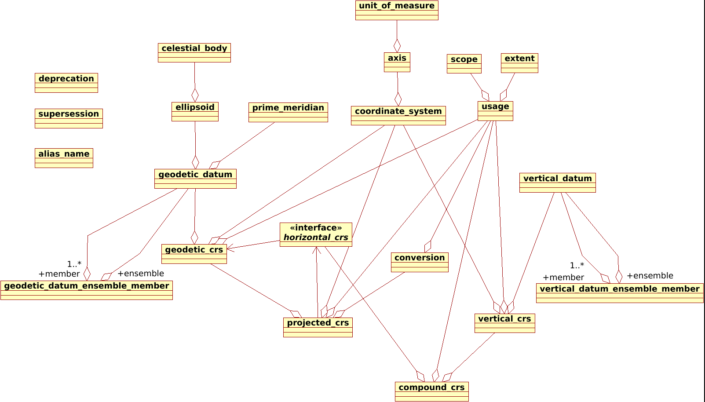
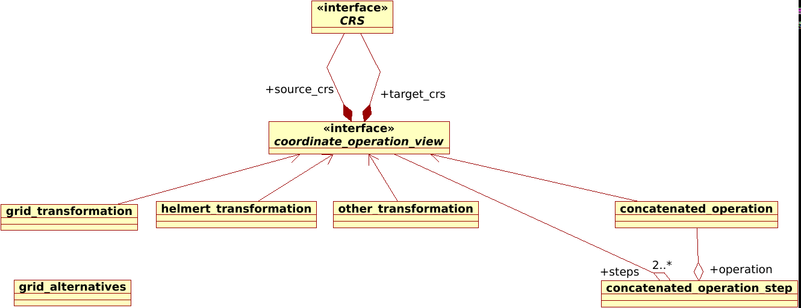

# Directory data/sql

- Simplified UML diagram of database classes:
     * [diagram.xmi](diagram.xmi): to be opened with Umbrello
     * CRS related tables: 
     * Transformation releated tables: 

- Hand generated files:
     * [proj_db_table_defs.sql](proj_db_table_defs.sql): Database structure: CREATE TABLE / CREATE VIEW / CREATE TRIGGER.
     * [metadata.sql](metadata.sql): key/value content of the metadata table.
     * [begin.sql](begin.sql): Technical prologue for all concatenated files.
     * [commit.sql](commit.sql): Epilogue for all concatenated files. Include consistency checks.
     * [customizations_early.sql](customizations_early.sql): Customizations to be applied before EPSG generated tables.
     * [customizations.sql](customizations.sql): Customizations to be applied after all geodetic registries.
     * [grid_alternatives.sql](grid_alternatives.sql): Link official EPSG grid names to PROJ ones.
     * [grid_transformation_custom.sql](grid_transformation_custom.sql): PROJ specific entries in grid_transformation table.
     * [other_transformation_custom.sql](other_transformation_custom.sql): PROJ specific entries in other_transformation table.

- Files generated from EPSG dataset by [build_db.py](https://github.com/OSGeo/PROJ/blob/master/scripts/build_db.py):
     * [alias_name.sql](alias_name.sql)
     * [axis.sql](axis.sql)
     * [compound_crs.sql](compound_crs.sql)
     * [concatenated_operation.sql](concatenated_operation.sql)
     * [concatenated_operation_step.sql](concatenated_operation_step.sql)
     * [conversion.sql](conversion.sql)
     * [conversion_triggers.sql](conversion_triggers.sql)
     * [coordinate_system.sql](coordinate_system.sql)
     * [deprecation.sql](deprecation.sql)
     * [ellipsoid.sql](ellipsoid.sql)
     * [extent.sql](extent.sql)
     * [geodetic_crs.sql](geodetic_crs.sql)
     * [geodetic_datum_ensemble_member.sql](geodetic_datum_ensemble_member.sql)
     * [geodetic_datum.sql](geodetic_datum.sql)
     * [grid_alternatives_generated_noaa.sql](grid_alternatives_generated_noaa.sql)
     * [grid_transformation.sql](grid_transformation.sql)
     * [helmert_transformation.sql](helmert_transformation.sql)
     * [other_transformation.sql](other_transformation.sql)
     * [prime_meridian.sql](prime_meridian.sql)
     * [projected_crs.sql](projected_crs.sql)
     * [scope.sql](scope.sql)
     * [supersession.sql](supersession.sql)
     * [unit_of_measure.sql](unit_of_measure.sql)
     * [vertical_crs.sql](vertical_crs.sql)
     * [vertical_datum_ensemble_member.sql](vertical_datum_ensemble_member.sql)
     * [vertical_datum.sql](vertical_datum.sql)

- Other registries:
     * [esri.sql](esri.sql): ESRI registry. Generated by [build_db_from_esri.py](https://github.com/OSGeo/PROJ/blob/master/scripts/build_db_from_esri.py)
     * [ignf.sql](ignf.sql): IGN France registry. Generated by [build_db_create_ignf_from_xml.py](https://github.com/OSGeo/PROJ/blob/master/scripts/build_db_create_ignf_from_xml.py)
     * [iau.sql](iau.sql): IAU 2015 registry. Generated by [build_db_from_iau.py](https://github.com/OSGeo/PROJ/blob/master/scripts/build_db_from_iau.py)
     * [versioned_auth_name_mapping.sql](versioned_auth_name_mapping.sql): used for the IAU:2015 / IAU alias
     * [nkg.sql](nkg.sql): Nordic Geodetic Commission registry. Hand-written
     * [nkg_post_customizations.sql](nkg_post_customizations.sql): Registration of NKG in authority_to_authority_preference table
