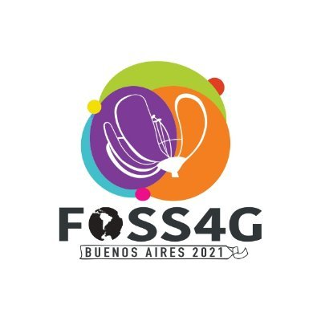

.. _community:

Community
===============================================================================

The PROJ community is what makes the software stand out from its competitors.
PROJ is used and developed by group of very enthusiastic, knowledgeable and
friendly people. Whether you are a first time user of PROJ or a long-time
contributor the community is always very welcoming.

.. toctree::
   :maxdepth: 1

   channels
   contributing
   code_contributions
   code_of_conduct
   rfc/index

Conference
----------

`FOSS4G 2021 <https://2021.foss4g.org/>`_ is the leading annual conference for
free and open source geospatial software. It will include presentations related
to PROJ, and some of the PROJ development community will be attending. It is the
event for those interested in PROJ, other FOSS geospatial technologies and the
community around them. The conference will due to COVID-19 be held in a virtual
setting September 27th - October 2nd, 2021.
