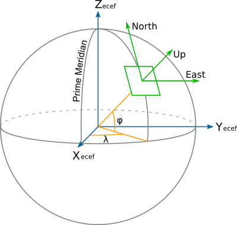

.. _topocentric:

================================================================================
Geocentric to topocentric conversion
================================================================================

.. versionadded:: 8.0.0

Convert geocentric coordinates to topocentric coordinates (in the forward path).

+---------------------+--------------------------------------------------------+
| **Alias**           | topocentric                                            |
+---------------------+--------------------------------------------------------+
| **Domain**          | 3D                                                     |
+---------------------+--------------------------------------------------------+
| **Input type**      | Geocentric cartesian coordinates                       |
+---------------------+--------------------------------------------------------+
| **Output type**     | Topocentric cartesian coordinates                      |
+---------------------+--------------------------------------------------------+

This operation converts geocentric coordinate values (X, Y, Z) to topocentric
(E/East, N/North, U/Up) values. This is also sometimes known as the ECEF (Earth
Centered Earth Fixed) to ENU conversion.

Topocentric coordinates are expressed in a frame whose East and North axis form
a local tangent plane to the Earth's ellipsoidal surface fixed to a specific
location (the topocentric origin), and the Up axis points upwards along the
normal to that plane.

..
  Source : https://en.wikipedia.org/wiki/Local_tangent_plane_coordinates#/media/File:ECEF_ENU_Longitude_Latitude_relationships.svg
  Public domain
..

The topocentric origin is a required parameter of the conversion, and can be
expressed either as geocentric coordinates (``X_0``, ``Y_0`` and ``Z_0``) or
as geographic coordinates (``lat_0``, ``lon_0``, ``h_0``).

When conversion between geographic and topocentric coordinates is desired, the
topocentric conversion must be preceded by the :ref:`cart` conversion to
perform the initial geographic to geocentric coordinates conversion.

The formulas used come from the "Geocentric/topocentric conversions" paragraph
of :cite:`IOGP2018`. ``+proj=topocentric`` alone corresponds to the ``EPSG:9836``
conversion method, ``+proj=cart`` followed by ``+proj=topocentric`` corresponds
to ``EPSG:9837``.

Usage
################################################################################

Convert geocentric coordinates to topocentric coordinates, with the topocentric
origin specified in geocentric coordinates::

    echo 3771793.968 140253.342 5124304.349 2020 | \
        cct -d 3 +proj=topocentric +ellps=WGS84 +X_0=3652755.3058 +Y_0=319574.6799 +Z_0=5201547.3536

    -189013.869    -128642.040     -4220.171     2020.0000

Convert geographic coordinates to topocentric coordinates, with the topocentric
origin specified in geographic coordinates::

    echo 2.12955 53.80939444 73 2020 | cct -d 3 +proj=pipeline \
        +step +proj=cart +ellps=WGS84 \
        +step +proj=topocentric +ellps=WGS84 +lon_0=5 +lat_0=55 +h_0=200

    -189013.869    -128642.040     -4220.171     2020.0000

Parameters
################################################################################

.. include:: ../options/ellps.rst

Topocentric origin described as geocentric coordinates
------------------------------------------------------

.. note::

    The below options are mutually exclusive with the ones to express the origin as geographic coordinates.

.. option:: +X_0=<value>

    Geocentric X value of the topocentric origin (in metre)

.. option:: +Y_0=<value>

    Geocentric Y value of the topocentric origin (in metre)

.. option:: +Z_0=<value>

    Geocentric Z value of the topocentric origin (in metre)

Topocentric origin described as geographic coordinates
------------------------------------------------------

.. note::

    The below options are mutually exclusive with the ones to express the origin as geocentric coordinates.

.. option:: +lat_0=<value>

    Latitude of topocentric origin (in degree)

.. option:: +lon_0=<value>

    Longitude of topocentric origin (in degree)

.. option:: +h_0=<value>

    Ellipsoidal height of topocentric origin (in metre)

    *Defaults to 0.0.*
