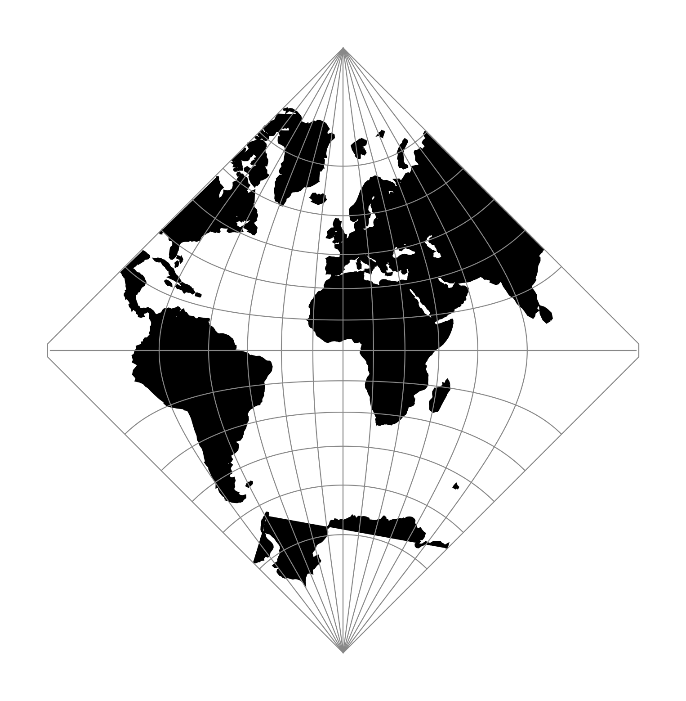

.. _adams_hemi:

********************************************************************************
Adams Hemisphere in a Square
********************************************************************************

+---------------------+----------------------------------------------------------+
| **Classification**  | Miscellaneous                                            |
+---------------------+----------------------------------------------------------+
| **Available forms** | Forward spherical projection                             |
+---------------------+----------------------------------------------------------+
| **Defined area**    | Global                                                   |
+---------------------+----------------------------------------------------------+
| **Alias**           | adams_hemi                                               |
+---------------------+----------------------------------------------------------+
| **Domain**          | 2D                                                       |
+---------------------+----------------------------------------------------------+
| **Input type**      | Geodetic coordinates                                     |
+---------------------+----------------------------------------------------------+
| **Output type**     | Projected coordinates                                    |
+---------------------+----------------------------------------------------------+

   proj-string: ``+proj=adams_hemi``

Parameters
################################################################################

.. note:: All parameters are optional.

.. include:: ../options/lon_0.rst

.. include:: ../options/R.rst

.. include:: ../options/x_0.rst

.. include:: ../options/y_0.rst
