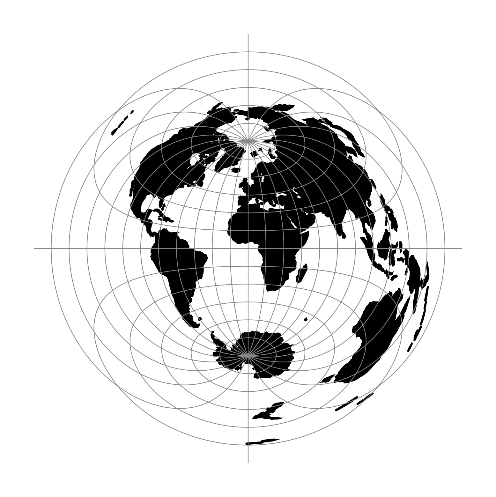

.. _aeqd:

********************************************************************************
Azimuthal Equidistant
********************************************************************************
+---------------------+----------------------------------------------------------+
| **Classification**  | Azimuthal                                                |
+---------------------+----------------------------------------------------------+
| **Available forms** | Forward and inverse, spherical and elliptical projection |
+---------------------+----------------------------------------------------------+
| **Alias**           | aeqd                                                     |
+---------------------+----------------------------------------------------------+
| **Domain**          | 2D                                                       |
+---------------------+----------------------------------------------------------+
| **Input type**      | Geodetic coordinates                                     |
+---------------------+----------------------------------------------------------+
| **Output type**     | Projected coordinates                                    |
+---------------------+----------------------------------------------------------+

Options
################################################################################

.. note:: All options are optional for the Azimuthal Equidistant projection.

.. option:: +guam

    Use Guam elliptical formulas. Only accurate near the Island of Guam
    (:math:`\lambda\approx 144.5^{\circ}`, :math:`\phi\approx 13.5^{\circ}`)

.. include:: ../options/k_0.rst

.. include:: ../options/lat_ts.rst

.. include:: ../options/lat_0.rst

.. include:: ../options/lon_0.rst

.. include:: ../options/x_0.rst

.. include:: ../options/y_0.rst

.. include:: ../options/ellps.rst

.. include:: ../options/R.rst
