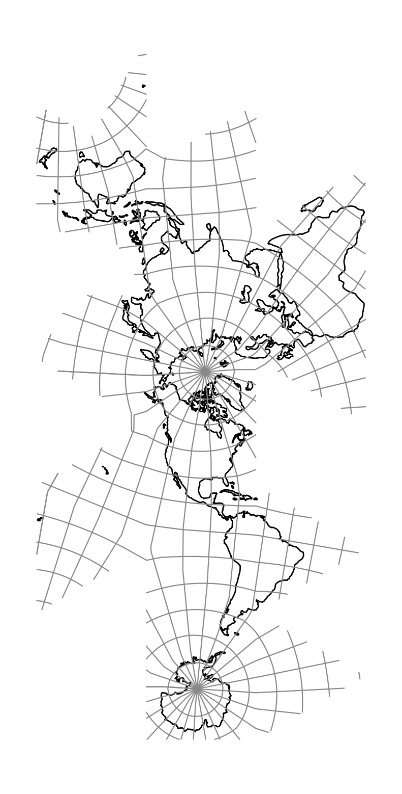

.. _airocean:

********************************************************************************
Airocean
********************************************************************************

.. versionadded:: 9.6.0

The Airocean map projection is a icosahedron polyhedral projection that intends
to lay down continental landmasses into a contiguous map with minimal scale and angular
distortion while preserving land surfaces from (most) interruptions.
In comparison to the Snyder's Icosahedral Equal Area, this projection relies on a specific way 
to orient and cut the icosahedron so that most interruptions lie within the ocean. The projection
was first invented by Buckminster Fuller in 1943 using a cuboctahedron as basis.
The idea to use an icosahedron came later in 1954, and it wasn't until 1978 that the projection 
was formally mathematically defined :cite:`Gray1995`.

+---------------------+----------------------------------------------------------+
| **Classification**  | Polyhedral, equal area                                   |
+---------------------+----------------------------------------------------------+
| **Available forms** | Forward and inverse, spherical and ellipsoidal           |
+---------------------+----------------------------------------------------------+
| **Defined area**    | Global                                                   |
+---------------------+----------------------------------------------------------+
| **Alias**           | airocean                                                 |
+---------------------+----------------------------------------------------------+
| **Domain**          | 2D                                                       |
+---------------------+----------------------------------------------------------+
| **Input type**      | Geodetic coordinates                                     |
+---------------------+----------------------------------------------------------+
| **Output type**     | Projected coordinates                                    |
+---------------------+----------------------------------------------------------+

   proj-string: ``+proj=airocean``

.. note::
   The airocean map of the whole globe has an extent of approximately
   :math:`[0, 0, 17404000, 36844000]` in meters. Although the airocean map has no
   true up or down, the choice was made to lay it out vertically, from Antarctica to Australia.

Parameters
################################################################################

.. note:: All parameters are optional for the projection.

.. option:: +orient=<string>

    Can be set to either ``vertical`` or ``horizontal``.

    *Defaults to vertical*

.. include:: ../options/lon_0.rst

.. include:: ../options/R.rst

.. include:: ../options/x_0.rst

.. include:: ../options/y_0.rst
