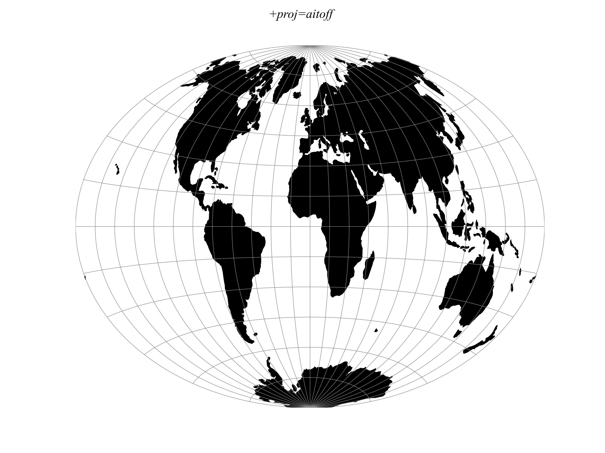

.. _aitoff:

********************************************************************************
Aitoff
********************************************************************************
+---------------------+----------------------------------------------------------+
| **Classification**  | Miscellaneous                                            |
+---------------------+----------------------------------------------------------+
| **Available forms** | Forward and inverse spherical projection                 |
+---------------------+----------------------------------------------------------+
| **Defined area**    | Global                                                   |
+---------------------+----------------------------------------------------------+
| **Alias**           | aitoff                                                   |
+---------------------+----------------------------------------------------------+
| **Domain**          | 2D                                                       |
+---------------------+----------------------------------------------------------+
| **Input type**      | Geodetic coordinates                                     |
+---------------------+----------------------------------------------------------+
| **Output type**     | Projected coordinates                                    |
+---------------------+----------------------------------------------------------+

   proj-string: ``+proj=aitoff``

Parameters
################################################################################

.. note:: All parameters for the projection are optional.

.. include:: ../options/lon_0.rst

.. include:: ../options/R.rst

.. include:: ../options/x_0.rst

.. include:: ../options/y_0.rst

Mathematical definition
################################################################################

The forward projection is

.. math::

    \alpha &= \arccos \left( \cos\phi \, \cos\tfrac{\lambda}{2} \right)

    x &= 2 \cos\phi \, \sin\tfrac{\lambda}{2} \; \frac{\alpha}{\sin\alpha}

    y &= \sin\phi \; \frac{\alpha}{\sin\alpha}

The Aitoff inverse has a closed form, so no iteration is required:

.. math::

    \alpha &= \sqrt{\left(\tfrac{x}{2}\right)^2 + y^2}

    \phi &= \arcsin \frac{y \sin\alpha}{\alpha}

    \lambda &= 2 \arctan2 \left( \tfrac{x}{2} \sin\alpha, \; \alpha \cos\alpha \right)

Further reading
################################################################################

#. Kleffner, R. (2026). "Aitoff has a closed-form inverse" :cite:`Kleffner2026`,
   which derives the inverse above and benchmarks it against the iterative
   method.
#. Kunimune, J. *Map-Projections* :cite:`KunimuneMapProjections`, an earlier
   implementation using an equivalent structural decomposition.
