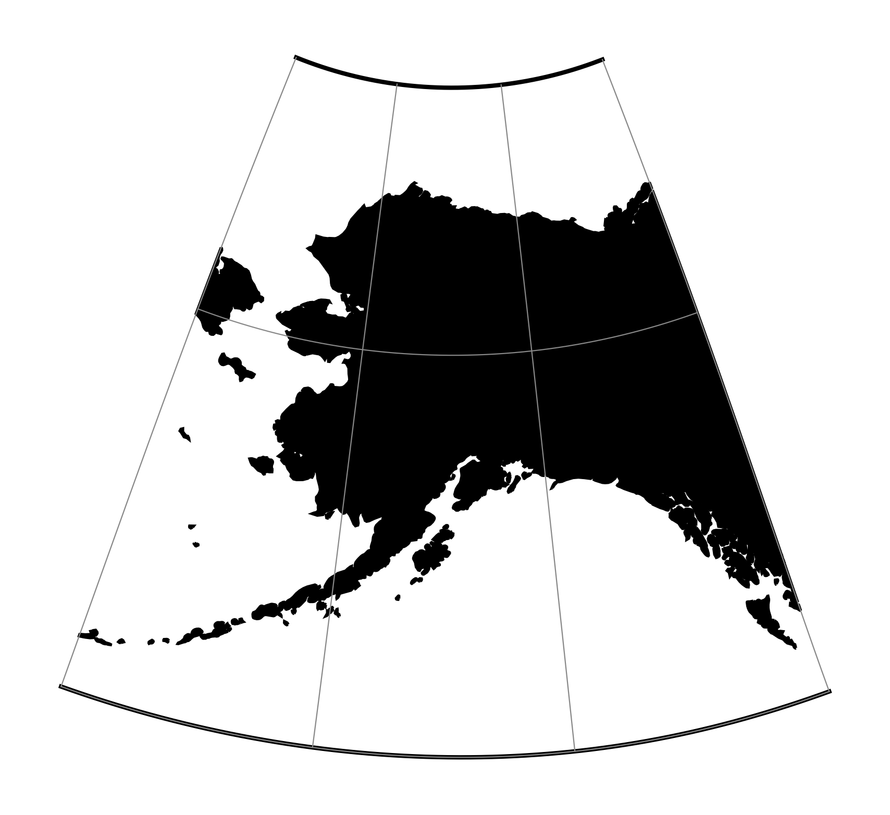

.. _alsk:

********************************************************************************
Modified Stererographics of Alaska
********************************************************************************
+---------------------+----------------------------------------------------------+
| **Classification**  | Modified azimuthal                                       |
+---------------------+----------------------------------------------------------+
| **Available forms** | Forward and inverse, spherical and elliptical projection |
+---------------------+----------------------------------------------------------+
| **Defined area**    | Alaska                                                   |
+---------------------+----------------------------------------------------------+
| **Alsk**            | alsk                                                     |
+---------------------+----------------------------------------------------------+
| **Domain**          | 2D                                                       |
+---------------------+----------------------------------------------------------+
| **Input type**      | Geodetic coordinates                                     |
+---------------------+----------------------------------------------------------+
| **Output type**     | Projected coordinates                                    |
+---------------------+----------------------------------------------------------+

   proj-string: ``+proj=alsk``

Options
################################################################################

.. note:: All options are optional for the projection.

.. include:: ../options/x_0.rst

.. include:: ../options/y_0.rst

.. include:: ../options/ellps.rst
