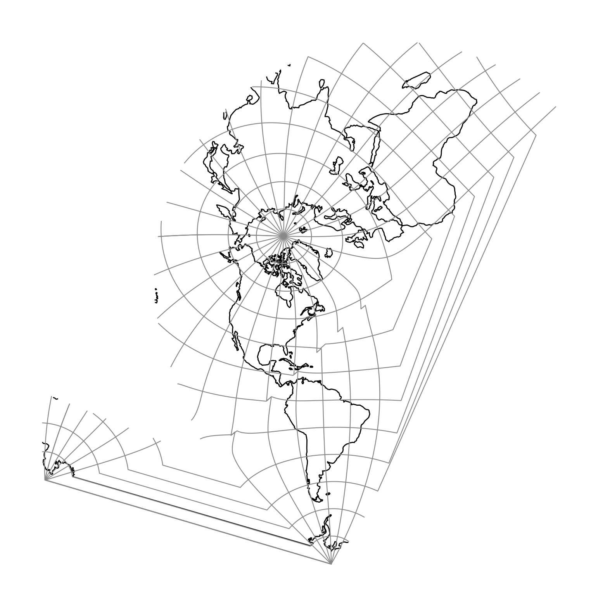

.. _bipc:

********************************************************************************
Bipolar conic of western hemisphere
********************************************************************************

   proj-string: ``+proj=bipc +ns``

Parameters
################################################################################

.. note:: All options are optional for the Bipolar Conic projection.

.. option:: +ns

    Return non-skewed cartesian coordinates.

.. include:: ../options/lon_0.rst

.. include:: ../options/R.rst

.. include:: ../options/x_0.rst

.. include:: ../options/y_0.rst
