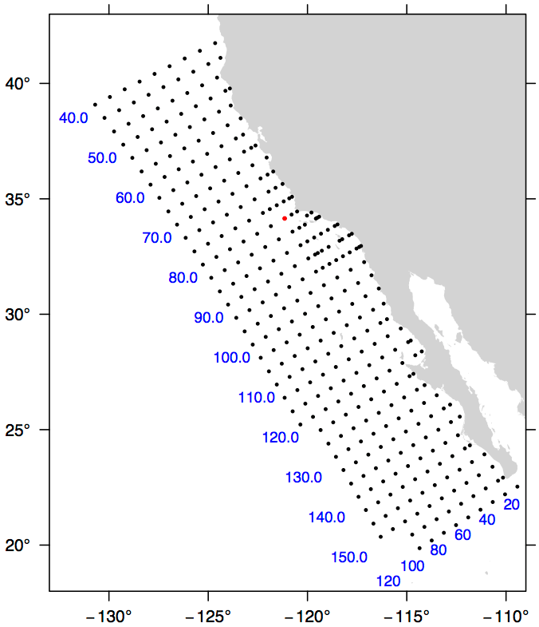

.. _calcofi:

********************************************************************************
Cal Coop Ocean Fish Invest Lines/Stations
********************************************************************************

The CalCOFI pseudo-projection is the line and station coordinate system of the
California Cooperative Oceanic Fisheries Investigations program, known as CalCOFI, for sampling offshore of the west coast of the U.S. and Mexico.

+---------------------+----------------------------------------------------------+
| **Classification**  | Conformal cylindrical                                    |
+---------------------+----------------------------------------------------------+
| **Available forms** | Forward and inverse, spherical and elliptical projection |
+---------------------+----------------------------------------------------------+
| **Defined area**    | Only valid for the west coast of USA and Mexico          |
+---------------------+----------------------------------------------------------+
| **Alias**           | calcofi                                                  |
+---------------------+----------------------------------------------------------+
| **Domain**          | 2D                                                       |
+---------------------+----------------------------------------------------------+
| **Input type**      | Geodetic coordinates                                     |
+---------------------+----------------------------------------------------------+
| **Output type**     | Projected coordinates                                    |
+---------------------+----------------------------------------------------------+

The coordinate system is based on the Mercator projection with units rotated -30
degrees from the meridian so that they are oriented with the coastline of the Southern California Bight and Baja California.
Lines increase from Northwest to Southeast.
A unit of line is 12 nautical miles. Stations increase from inshore to offshore.
A unit of station is equal to 4 nautical miles.
The rotation point is located at line 80, station 60, or 34.15 degrees N, -121.15 degrees W, and is depicted by the red dot in the figure.
By convention, the ellipsoid of Clarke 1866 is used to calculate CalCOFI coordinates.

The CalCOFI program is a joint research effort by the U.S. National Oceanic and
Atmospheric Administration, University of California Scripps Oceanographic Institute, and California Department of Fish and Game.
Surveys have been conducted for the CalCOFI program since 1951, creating one of the oldest and most scientifically valuable joint oceanographic and fisheries data sets in the world.
The CalCOFI line and station coordinate system is now used by several other programs including the Investigaciones Mexicanas de la Corriente de California (IMECOCAL) program offshore of Baja California.
The figure depicts some commonly sampled locations from line 40 to line 156.7 and offshore to station 120. Blue numbers indicate line (bottom) or station (left) numbers along the grid. Note that lines spaced at approximate 3-1/3 intervals are commonly sampled, e.g., lines 43.3 and 46.7.

Usage
###############################################################################

A typical forward CalCOFI projection would be from lon/lat coordinates on the
Clark 1866 ellipsoid.
For example::

    proj +proj=calcofi +ellps=clrk66 -E <<EOF
    -121.15 34.15
    EOF

Output of the above command::

    -121.15 34.15   80.00   60.00

The reverse projection from line/station coordinates to lon/lat would be entered
as::

    proj +proj=calcofi +ellps=clrk66 -I -E -f "%.2f" <<EOF
    80.0 60.0
    EOF

Output of the above command::

    80.0 60.0   -121.15 34.15

Options
################################################################################

.. note:: All options are optional for the CalCOFI projection.

.. include:: ../options/ellps.rst

.. include:: ../options/R.rst

Mathematical definition
################################################################################

The algorithm used to make conversions is described in :cite:`EberHewitt1979` with
a few corrections reported in :cite:`WeberMoore2013`.

Further reading
################################################################################

#. `General information about the CalCOFI program <http://www.calcofi.org>`_
#. `The Investigaciones Mexicanas de la Corriente de California <http://imecocal.cicese.mx>`_

