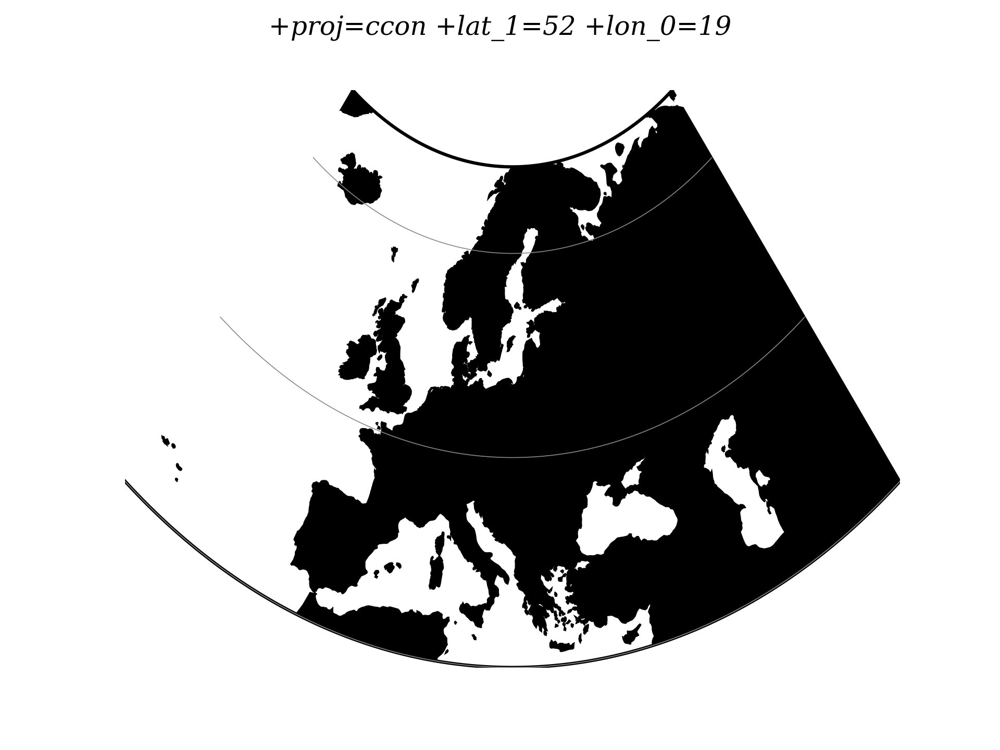

.. _ccon:

********************************************************************************
Central Conic
********************************************************************************

.. versionadded:: 5.0.0

This is central (centrographic) projection on cone tangent at :option:``lat_1``
latitude, identical with ``conic()`` projection from ``mapproj`` R package.

+---------------------+----------------------------------------------------------+
| **Classification**  | Conic                                                    |
+---------------------+----------------------------------------------------------+
| **Available forms** | Forward and inverse, spherical projection                |
+---------------------+----------------------------------------------------------+
| **Defined area**    | Global, but best used near the standard parallel         |
+---------------------+----------------------------------------------------------+
| **Alias**           | ccon                                                     |
+---------------------+----------------------------------------------------------+
| **Domain**          | 2D                                                       |
+---------------------+----------------------------------------------------------+
| **Input type**      | Geodetic coordinates                                     |
+---------------------+----------------------------------------------------------+
| **Output type**     | Projected coordinates                                    |
+---------------------+----------------------------------------------------------+

   proj-string: ``+proj=ccon +lat_1=52 +lon_0=19``

Usage
########

This simple projection is rarely used, as it is not equidistant, equal-area, nor
conformal.

An example of usage (and the main reason to implement this projection in proj4)
is the ATPOL geobotanical grid of Poland, developed in Institute of Botany,
Jagiellonian University, Krakow, Poland in 1970s :cite:`Zajac1978`. The grid was
originally handwritten on paper maps and further copied by hand. The projection
(together with strange Earth radius) was chosen by its creators as the compromise
fit to existing maps during first software development in DOS era. Many years later
it is still de facto standard grid in Polish geobotanical research.

The ATPOL coordinates can be achieved with with the following parameters:

::

   +proj=ccon +lat_1=52 +lon_0=19 +axis=esu +a=6390000 +x_0=330000 +y_0=-350000

For more information see :cite:`Komsta2016` and :cite:`Verey2017`.

Parameters
################################################################################

Required
-------------------------------------------------------------------------------

.. option:: +lat_1=<value>

    Standard parallel of projection.

Optional
-------------------------------------------------------------------------------

.. include:: ../options/lon_0.rst

.. include:: ../options/R.rst

.. include:: ../options/x_0.rst

.. include:: ../options/y_0.rst

Mathematical definition
################################################################################

Forward projection
-------------------------------------------------------------------------------

.. math::

   r = \cot \phi_0 - \tan (\phi - \phi_0)

.. math::

   x = r \sin (\lambda\sin\phi_0)

.. math::

   y = \cot \phi_0 - r \cos (\lambda\sin\phi_0)

Inverse projection
-------------------------------------------------------------------------------

.. math::

   y = \cot \phi_0 - y

.. math::

   \phi = \phi_0 - \tan^{-1} ( \sqrt{x^2+y^2} - \cot \phi_0 )

.. math::

   \lambda = \frac{\tan^{-1} \sqrt{x^2+y^2}}{\sin \phi_0}

Reference values
################################################################################

For ATPOL to WGS84 test, run the following script:

::

   #!/bin/bash
   cat << EOF | src/cs2cs -v -f "%E" +proj=ccon +lat_1=52 +lat_0=52 +lon_0=19 +axis=esu +a=6390000 +x_0=330000 +y_0=-350000 +to +proj=longlat
   0 0
   0 700000
   700000 0
   700000 700000
   330000 350000
   EOF

It should result with

::

   1.384023E+01 5.503040E+01 0.000000E+00
   1.451445E+01 4.877385E+01 0.000000E+00
   2.478271E+01 5.500352E+01 0.000000E+00
   2.402761E+01 4.875048E+01 0.000000E+00
   1.900000E+01 5.200000E+01 0.000000E+00

Analogous script can be run for reverse test:

::

   cat << EOF  | src/cs2cs -v -f "%E" +proj=longlat +to +proj=ccon +lat_1=52 +lat_0=52 +lon_0=19 +axis=esu +a=6390000 +x_0=330000 +y_0=-350000
   24 55
   15 49
   24 49
   19 52
   EOF

and it should give the following results:

::

   6.500315E+05 4.106162E+03 0.000000E+00
   3.707419E+04 6.768262E+05 0.000000E+00
   6.960534E+05 6.722946E+05 0.000000E+00
   3.300000E+05 3.500000E+05 0.000000E+00
