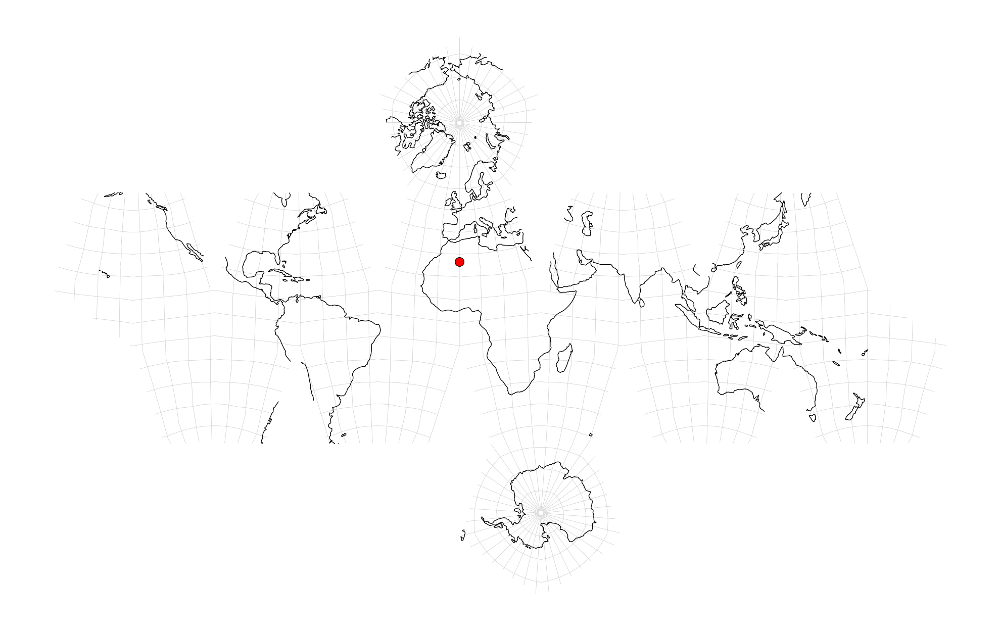
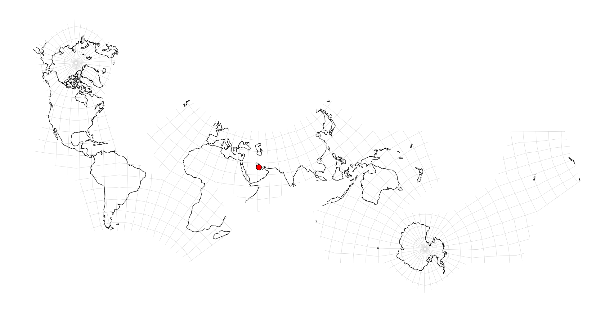
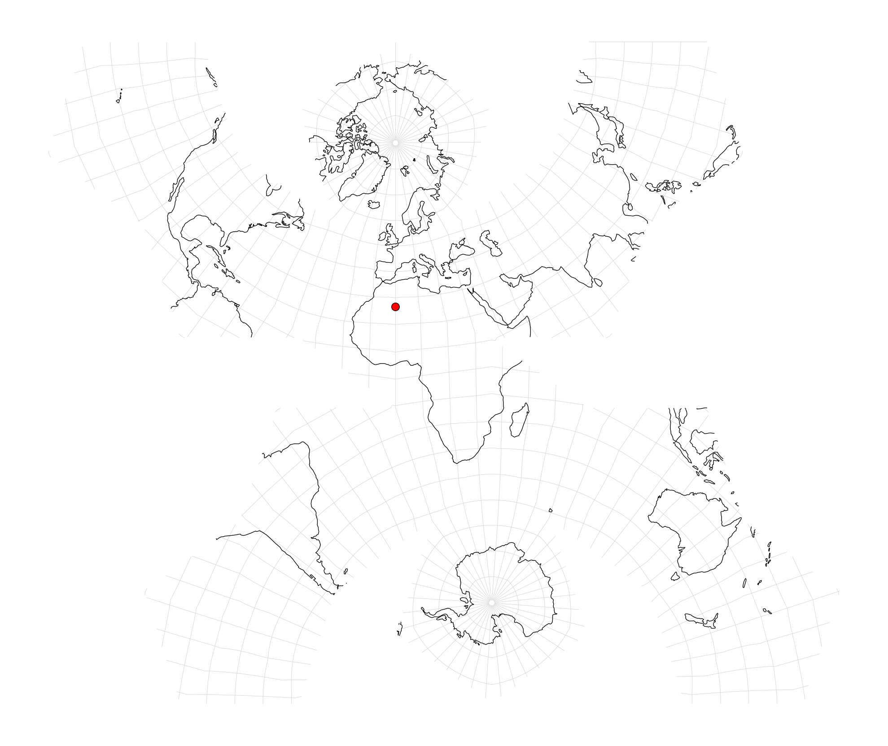
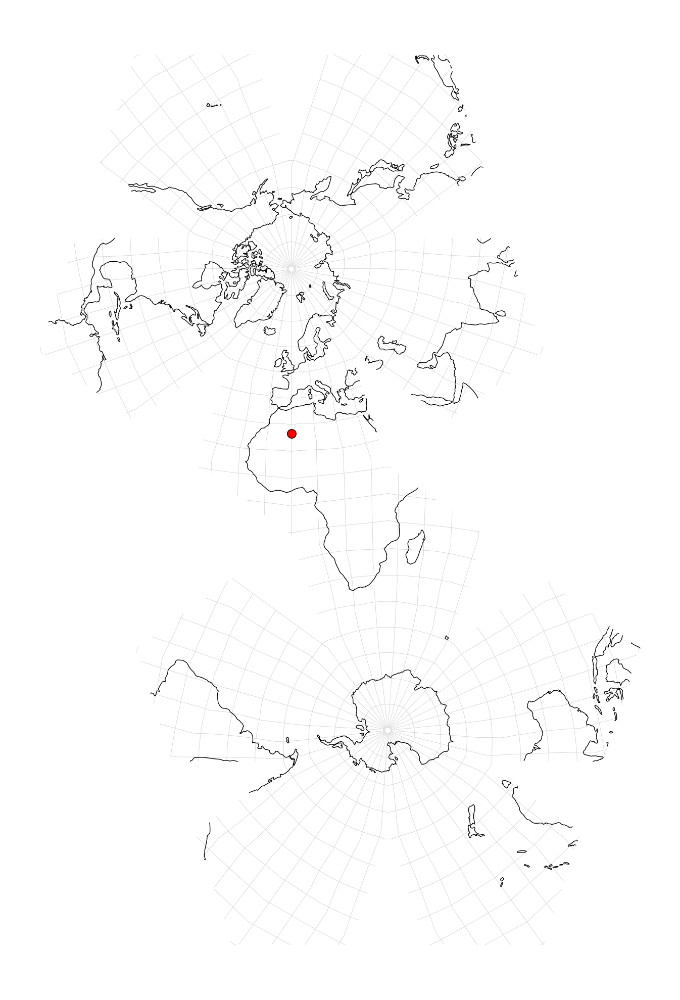

.. _dsea:

********************************************************************************
Dodecahedral Snyder Equal Area
********************************************************************************

Snyder's equal-area mapping :cite:`Snyder1992` applied to the twelve pentagonal
faces of a regular dodecahedron and unfolded into a planar net.

The dodecahedron is subdivided into 12 × 10 = 120 right sub-triangles,
and each sub-triangle is mapped independently using the area-preserving
Snyder construction.

See :ref:`polyhedral` for the shared theory.

+---------------------+----------------------------------------------------------+
| **Classification**  | Polyhedral, equal area                                   |
+---------------------+----------------------------------------------------------+
| **Available forms** | Forward and inverse, spherical and ellipsoidal           |
+---------------------+----------------------------------------------------------+
| **Defined area**    | Global                                                   |
+---------------------+----------------------------------------------------------+
| **Alias**           | dsea                                                     |
+---------------------+----------------------------------------------------------+
| **Domain**          | 2D                                                       |
+---------------------+----------------------------------------------------------+
| **Input type**      | Geodetic coordinates                                     |
+---------------------+----------------------------------------------------------+
| **Output type**     | Projected coordinates                                    |
+---------------------+----------------------------------------------------------+

   proj-string: ``+proj=dsea``

Nets
################################################################################

dsea (default)
--------------------------------------------------------------------------------

Snyder's layout (Figure 11).

   proj-string: ``+proj=dsea``

a5
--------------------------------------------------------------------------------

Layout used by the `A5 index <https://a5geo.org>`_. First 8 faces contain the
majority of the populated land mass.

   proj-string: ``+proj=dsea +net=a5``

crescent
--------------------------------------------------------------------------------

   proj-string: ``+proj=dsea +net=crescent``

flower
--------------------------------------------------------------------------------

   proj-string: ``+proj=dsea +net=flower``

Parameters
################################################################################

.. note::
    All parameters are optional.

.. option:: +net=<name>

    Selects the planar unfolding. Accepted values: ``dsea``, ``a5``,
    ``crescent``, ``flower``.

    *Defaults to* ``dsea``.

.. include:: ../options/orient_lat.rst

*Defaults to* ``atan((1 + 2·cos(36°))/2) ≈ 52.6226°``.

.. include:: ../options/orient_lon.rst

*Defaults to −36.0 (or −129.0 when* ``+net=a5`` *).*

.. include:: ../options/azi.rst

*Defaults to 240.0.*

.. include:: ../options/lat_0_polyhedral.rst

.. include:: ../options/lon_0_polyhedral.rst

.. include:: ../options/x_0.rst

.. include:: ../options/y_0.rst

.. include:: ../options/ellps.rst

.. include:: ../options/R.rst
