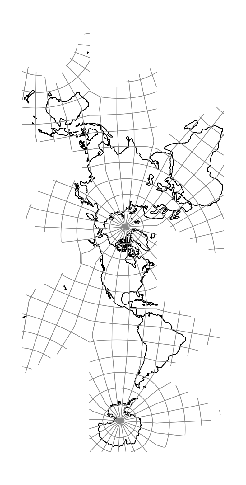

.. _dymaxion:

********************************************************************************
Dymaxion Fuller
********************************************************************************

The Dymaxion Fuller map projection is a icosahedron polyhedral projection that intends
to lay out most of continental landmasses unto a flat surface with as few land cuts
as possible while minimizing scale and angular distorsion.
In comparison to the Snyder's Icosahedral Equal Area, this projection relies on a specific way 
to orient and cut the icosahedron so that most interruptions lie in the ocean. The projection
was first invented by Buckminster Fuller in 1943 using a cubostahedron as basis.
The idea to use an icosahedron came later in 1954, and it wasn't until 1978 that the projection 
was formally mathematically defined :cite:`Gray1995`.

+---------------------+----------------------------------------------------------+
| **Classification**  | Polyhedral, equal area                                   |
+---------------------+----------------------------------------------------------+
| **Available forms** | Forward and inverse, spherical                           |
+---------------------+----------------------------------------------------------+
| **Defined area**    | Global                                                   |
+---------------------+----------------------------------------------------------+
| **Alias**           | dymaxion                                                 |
+---------------------+----------------------------------------------------------+
| **Domain**          | 2D                                                       |
+---------------------+----------------------------------------------------------+
| **Input type**      | Geodetic coordinates                                     |
+---------------------+----------------------------------------------------------+
| **Output type**     | Projected coordinates                                    |
+---------------------+----------------------------------------------------------+

   proj-string: ``+proj=dymaxion``

Parameters
################################################################################

.. note:: All parameters are optional for the projection.

.. include:: ../options/lon_0.rst

.. include:: ../options/R.rst

.. include:: ../options/x_0.rst

.. include:: ../options/y_0.rst
