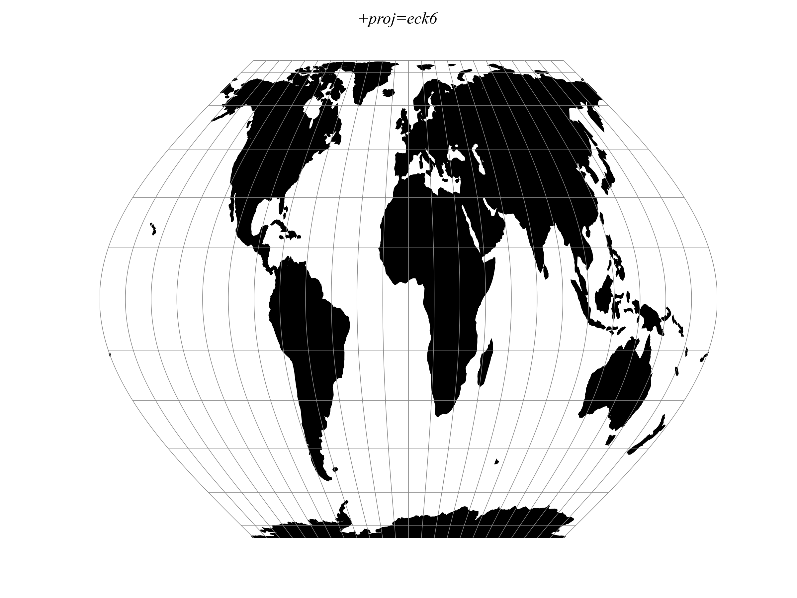

.. _eck6:

********************************************************************************
Eckert VI
********************************************************************************

+---------------------+----------------------------------------------------------+
| **Classification**  | Pseudocylindrical                                        |
+---------------------+----------------------------------------------------------+
| **Available forms** | Forward and inverse, spherical projection                |
+---------------------+----------------------------------------------------------+
| **Defined area**    | Global                                                   |
+---------------------+----------------------------------------------------------+
| **Alias**           | eck6                                                     |
+---------------------+----------------------------------------------------------+
| **Domain**          | 2D                                                       |
+---------------------+----------------------------------------------------------+
| **Input type**      | Geodetic coordinates                                     |
+---------------------+----------------------------------------------------------+
| **Output type**     | Projected coordinates                                    |
+---------------------+----------------------------------------------------------+

   proj-string: ``+proj=eck6``

Parameters
################################################################################

.. note:: All parameters are optional for the Eckert VI projection.

.. include:: ../options/lon_0.rst

.. include:: ../options/R.rst

.. include:: ../options/x_0.rst

.. include:: ../options/y_0.rst
