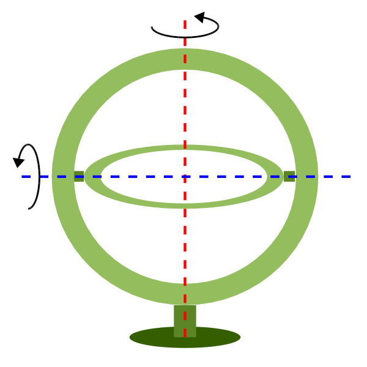

.. _geos:

********************************************************************************
Geostationary Satellite View
********************************************************************************

The geos projection pictures how a geostationary satellite scans the earth at regular
scanning angle intervals.

+---------------------+----------------------------------------------------------+
| **Classification**  | Azimuthal                                                |
+---------------------+----------------------------------------------------------+
| **Available forms** | Forward and inverse, spherical and ellipsoidal           |
+---------------------+----------------------------------------------------------+
| **Defined area**    | Global                                                   |
+---------------------+----------------------------------------------------------+
| **Alias**           | geos                                                     |
+---------------------+----------------------------------------------------------+
| **Domain**          | 2D                                                       |
+---------------------+----------------------------------------------------------+
| **Input type**      | Geodetic coordinates                                     |
+---------------------+----------------------------------------------------------+
| **Output type**     | Projected coordinates                                    |
+---------------------+----------------------------------------------------------+

.. figure:: ./images/geos.png
   :width: 500 px
   :align: center
   :alt:   Geostationary Satellite View

   proj-string: ``+proj=geos +h=35785831.0 +lon_0=-60 +sweep=y``

Usage
###############################################################################

In order to project using the geos projection you can do the following::

    proj +proj=geos +h=35785831.0

The required argument ``h`` is the viewing point (satellite position) height above
the earth.

The projection coordinate relate to the scanning angle by the following simple
relation::

    scanning_angle (radians) = projection_coordinate / h

Note on sweep angle
-------------------------------------------------------------------------------

The viewing instrument on-board geostationary satellites described by this
projection have a two-axis gimbal viewing geometry. This means that the different
scanning positions are obtained by rotating the gimbal along a N/S axis (or ``y``)
and a E/W axis (or ``x``).

In the image above, the outer-gimbal axis, or sweep-angle axis, is the N/S axis (``y``)
while the inner-gimbal axis, or fixed-angle axis, is the E/W axis (``x``).

This example represents the scanning geometry of the Meteosat series satellite.
However, the GOES satellite series use the opposite scanning geometry, with the
E/W axis (``x``) as the sweep-angle axis, and the N/S (``y``) as the fixed-angle axis.

The sweep argument is used to tell PROJ which on which axis the outer-gimbal
is rotating. The possible values are x or y, y being the default. Thus, the
scanning geometry of the Meteosat series satellite should take sweep as y, and
GOES should take sweep as x.

Parameters
################################################################################

Required
-------------------------------------------------------------------------------

.. include:: ../options/h.rst

Optional
-------------------------------------------------------------------------------

.. option:: +sweep=<axis>

    Sweep angle axis of the viewing instrument. Valid options are *"x"* and *"y*".

    *Defaults to "y".*

.. include:: ../options/lon_0.rst

.. include:: ../options/R.rst

.. include:: ../options/ellps.rst

.. include:: ../options/x_0.rst

.. include:: ../options/y_0.rst

