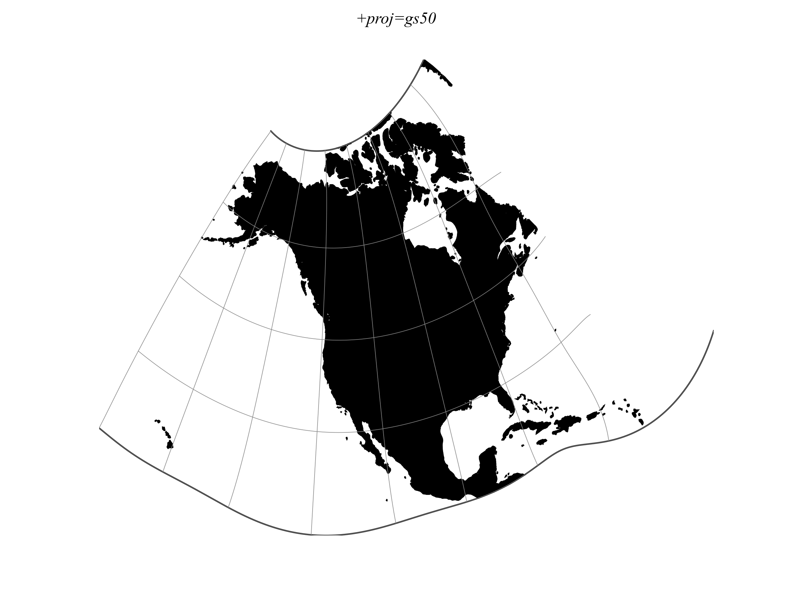

.. _gs50:

********************************************************************************
Mod. Stererographics of 50 U.S.
********************************************************************************

+---------------------+----------------------------------------------------------+
| **Classification**  | Azimuthal                                                |
+---------------------+----------------------------------------------------------+
| **Available forms** | Forward and inverse, spherical and ellipsoidal           |
+---------------------+----------------------------------------------------------+
| **Defined area**    | All 50 states of the U.S.                                |
+---------------------+----------------------------------------------------------+
| **Alias**           | gs50                                                     |
+---------------------+----------------------------------------------------------+
| **Domain**          | 2D                                                       |
+---------------------+----------------------------------------------------------+
| **Input type**      | Geodetic coordinates                                     |
+---------------------+----------------------------------------------------------+
| **Output type**     | Projected coordinates                                    |
+---------------------+----------------------------------------------------------+

   proj-string: ``+proj=gs50``

Parameters
################################################################################

.. note:: All parameters are optional for the projection.

.. include:: ../options/ellps.rst

.. include:: ../options/x_0.rst

.. include:: ../options/y_0.rst
