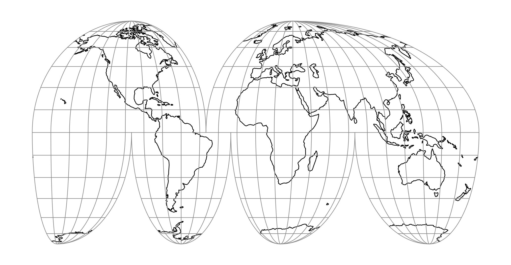

.. _imoll:

********************************************************************************
Interrupted Mollweide
********************************************************************************

+---------------------+----------------------------------------------------------+
| **Classification**  | Pseudocylindrical                                        |
+---------------------+----------------------------------------------------------+
| **Available forms** | Forward and inverse, spherical projection                |
+---------------------+----------------------------------------------------------+
| **Defined area**    | Global                                                   |
+---------------------+----------------------------------------------------------+
| **Alias**           | imoll                                                    |
+---------------------+----------------------------------------------------------+
| **Domain**          | 2D                                                       |
+---------------------+----------------------------------------------------------+
| **Input type**      | Geodetic coordinates                                     |
+---------------------+----------------------------------------------------------+
| **Output type**     | Projected coordinates                                    |
+---------------------+----------------------------------------------------------+

   proj-string: ``+proj=imoll``

The Interrupted Mollweide projection is an equal-area projection intended for
making world maps. The projection is comprised of six separate Mollweide
(``homolographic``) projection regions. In contrast with the Interrupted Goode
Homolosine projection, there is no transition latitude, which gives greater
continuity at the cost of greater equatorial distortion. The lobes in this
projection are chosen to emphasize the land area of the Earth. This projection
was first published in 1919 by J. P. Goode :cite:`Goode1919`.

Parameters
################################################################################

.. note:: All parameters are optional for the projection.

.. include:: ../options/lon_0.rst

.. include:: ../options/R.rst

.. include:: ../options/x_0.rst

.. include:: ../options/y_0.rst
