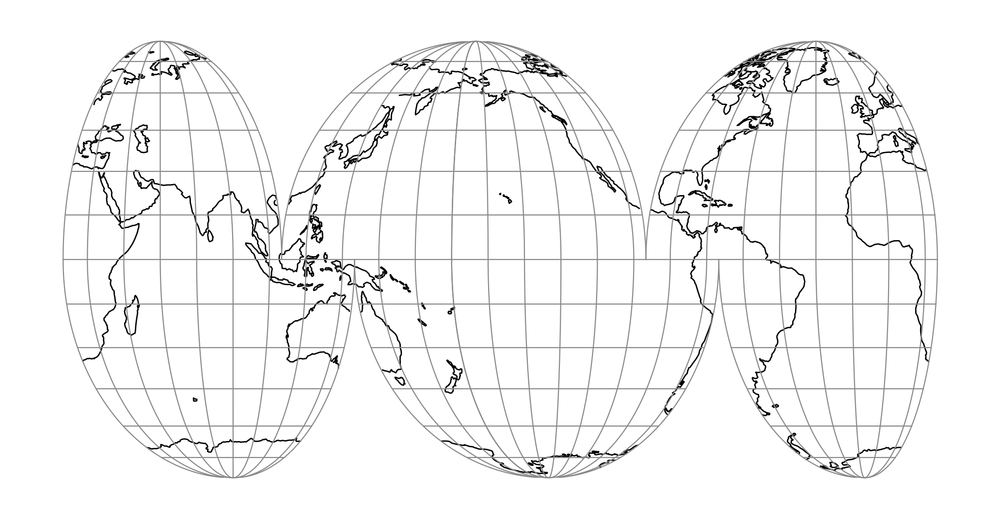

.. _imoll_o:

********************************************************************************
Interrupted Mollweide (Oceanic View)
********************************************************************************

+---------------------+----------------------------------------------------------+
| **Classification**  | Pseudocylindrical                                        |
+---------------------+----------------------------------------------------------+
| **Available forms** | Forward and inverse, spherical projection                |
+---------------------+----------------------------------------------------------+
| **Defined area**    | Global                                                   |
+---------------------+----------------------------------------------------------+
| **Alias**           | imoll_o                                                  |
+---------------------+----------------------------------------------------------+
| **Domain**          | 2D                                                       |
+---------------------+----------------------------------------------------------+
| **Input type**      | Geodetic coordinates                                     |
+---------------------+----------------------------------------------------------+
| **Output type**     | Projected coordinates                                    |
+---------------------+----------------------------------------------------------+

   proj-string: ``+proj=imoll_o +lon_0=-160``

The Interrupted Mollweide (Oceanic View) projection is an equal-area projection
intended for making maps of the Earth's oceans. The projection is comprised of
six separate Mollweide (``homolographic``) projection regions. In contrast with
the Interrupted Goode Homolosine (Oceanic View) projection, there is no
transition latitude, which gives greater continuity at the cost of greater
equatorial distortion. The lobes in this projection are chosen to emphasize the
ocean area of the Earth when used with a central longitude of -160
degrees. This projection was first published in 1919 by J. P. Goode
:cite:`Goode1919`.

Parameters
################################################################################

.. note:: All parameters are optional for the projection. A value of +lon_0=-160 is recommended.

.. include:: ../options/lon_0.rst

.. include:: ../options/R.rst

.. include:: ../options/x_0.rst

.. include:: ../options/y_0.rst
