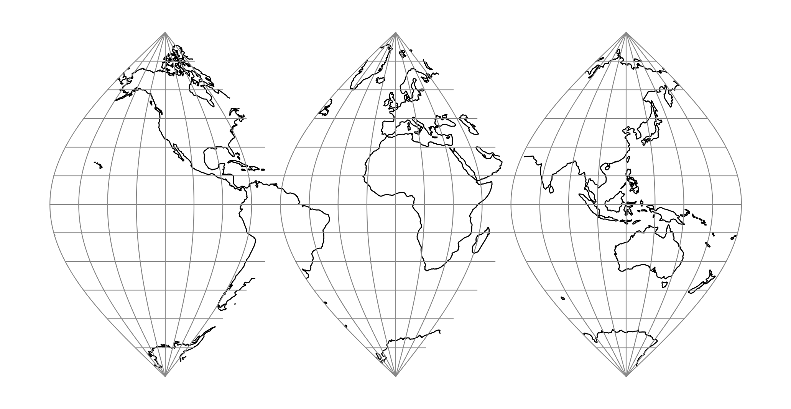

.. _interrupted:

********************************************************************************
Interrupted
********************************************************************************

+---------------------+----------------------------------------------------------+
| **Classification**  | Interrupted meta-projection                              |
+---------------------+----------------------------------------------------------+
| **Available forms** | Forward and inverse, spherical and ellipsoidal           |
+---------------------+----------------------------------------------------------+
| **Defined area**    | Global                                                   |
+---------------------+----------------------------------------------------------+
| **Alias**           | interrupted                                              |
+---------------------+----------------------------------------------------------+
| **Domain**          | 2D                                                       |
+---------------------+----------------------------------------------------------+
| **Input type**      | Geodetic coordinates                                     |
+---------------------+----------------------------------------------------------+
| **Output type**     | Projected coordinates                                    |
+---------------------+----------------------------------------------------------+

   proj-string: ``+proj=interrupted +base=sinu``

Meta-projection to create interrupted maps using different base projections.
The supported projections are :ref:`cass`, :ref:`poly`, :ref:`sinu` and :ref:`tmerc`.
The world is divided in gores tangent at the equator. :cite:`Huck2024`

Parameters
################################################################################

.. note:: All parameters are optional for the Interrupted projection except ``base``.

.. option:: +base=<value>

    Base projection. It can be one of ``cass``, ``poly``, ``sinu`` or ``tmerc``.
    Note that some projections may not behave correctly with too wide gores.

.. option:: +gores=<value>

    :option:`+gores` can be a number or a list of comma separated values.
    When it is a single number, it is the number of equal gores.
    When it is a list, they are the relative sizes of the gores (v.g. ``1,2,1``).

    *Defaults to 3.*

.. include:: ../options/lon_0.rst

.. include:: ../options/ellps.rst

.. include:: ../options/R.rst

.. include:: ../options/x_0.rst

.. include:: ../options/y_0.rst
