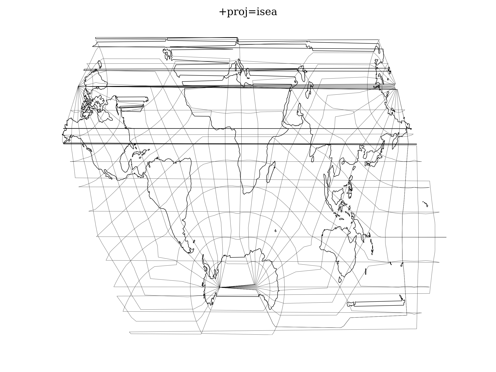

.. _isea:

********************************************************************************
Icosahedral Snyder Equal Area
********************************************************************************

Snyder's Icosahedral Equal Area map projections on polyhedral globes for the
dodecahedron and truncated icosahedron offer relatively low scale and
angular distortion. The equations involved are relatively straight-forward,
and for certain instructional tools and databases, the projections are useful
for world maps. The interruptions remain a disadvantage, as with any low-error
projection system applied to the entire globe :cite:`Snyder1992`.

+---------------------+----------------------------------------------------------+
| **Classification**  | Polyhedral, equal area                                   |
+---------------------+----------------------------------------------------------+
| **Available forms** | Forward, spherical                                       |
+---------------------+----------------------------------------------------------+
| **Defined area**    | Global                                                   |
+---------------------+----------------------------------------------------------+
| **Alias**           | isea                                                     |
+---------------------+----------------------------------------------------------+
| **Domain**          | 2D                                                       |
+---------------------+----------------------------------------------------------+
| **Input type**      | Geodetic coordinates                                     |
+---------------------+----------------------------------------------------------+
| **Output type**     | Projected coordinates                                    |
+---------------------+----------------------------------------------------------+

   proj-string: ``+proj=isea``

Parameters
################################################################################

.. note:: All parameters are optional for the projection.

.. option:: +orient=<string>

    Can be set to either ``isea`` or ``pole``.

.. option:: +azi=<value>

    Azimuth.

    *Defaults to 0.0*

.. option:: +aperture=<value>

    *Defaults to 3.0*

.. option:: +resolution=<value>

    *Defaults to 4.0*

.. option:: +mode=<string>

    Can be either ``plane``, ``di``, ``dd`` or ``hex``.

.. include:: ../options/lon_0.rst

.. include:: ../options/lat_0.rst

.. include:: ../options/R.rst

.. include:: ../options/x_0.rst

.. include:: ../options/y_0.rst
