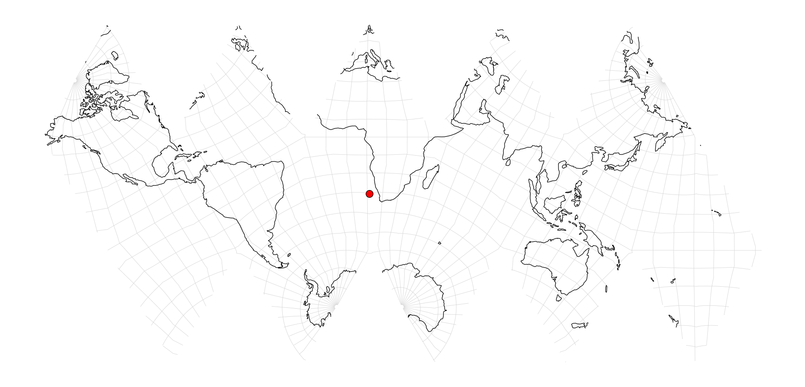
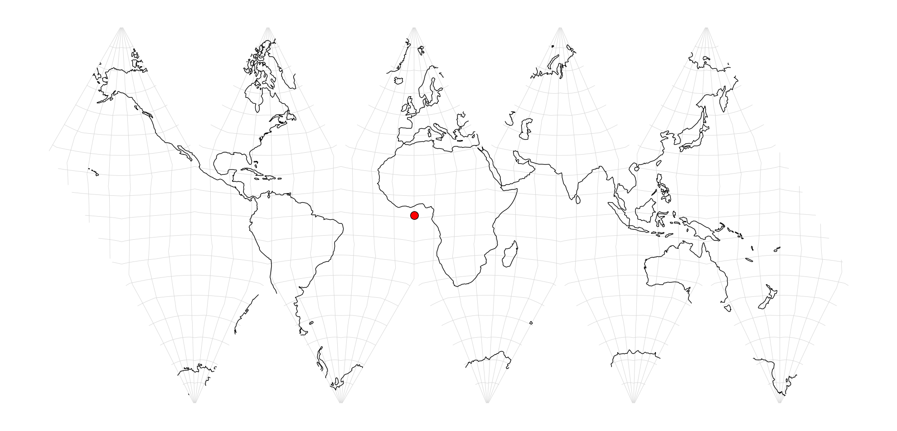

.. _isea:

********************************************************************************
Icosahedral Snyder Equal Area
********************************************************************************

Snyder's equal-area mapping :cite:`Snyder1992` applied to the twenty triangular
faces of a regular icosahedron and unfolded into a planar net.

The icosahedron is subdivided into 20 × 6 = 120 right sub-triangles, and each
sub-triangle is mapped independently using the area-preserving Snyder
construction.

See :ref:`polyhedral` for the shared theory.

+---------------------+----------------------------------------------------------+
| **Classification**  | Polyhedral, equal area                                   |
+---------------------+----------------------------------------------------------+
| **Available forms** | Forward and inverse, spherical and ellipsoidal           |
+---------------------+----------------------------------------------------------+
| **Defined area**    | Global                                                   |
+---------------------+----------------------------------------------------------+
| **Alias**           | isea                                                     |
+---------------------+----------------------------------------------------------+
| **Domain**          | 2D                                                       |
+---------------------+----------------------------------------------------------+
| **Input type**      | Geodetic coordinates                                     |
+---------------------+----------------------------------------------------------+
| **Output type**     | Projected coordinates                                    |
+---------------------+----------------------------------------------------------+

   proj-string: ``+proj=isea``

Nets
################################################################################

``isea`` ships a single net (Snyder's Figure 12). Two named orientations of
that net are available via ``+orient=``.

isea (default)
--------------------------------------------------------------------------------

Snyder's layout (Figure 12).

   proj-string: ``+proj=isea``

pole
--------------------------------------------------------------------------------

One icosahedron vertex placed on the geographic north pole.

   proj-string: ``+proj=isea +orient=pole``

Parameters
################################################################################

.. note::
    All parameters are optional.

.. option:: +orient=<name>

    Shorthand for two named orientations. Accepted values: ``isea``, ``pole``.
    Equivalent to setting ``+orient_lat`` / ``+orient_lon`` / ``+azi``
    explicitly; individual ``+orient_*`` parameters still override.

    *Defaults to* ``isea``.

.. include:: ../options/orient_lat.rst

*Defaults to ~58.40° geodetic (arctan(φ) ≈ 58.2825° authalic).*

.. include:: ../options/orient_lon.rst

*Defaults to 11.25° on a sphere, 11.20° on an ellipsoid.*

.. include:: ../options/azi.rst

*Defaults to 0.0.*

.. include:: ../options/lat_0_polyhedral.rst

.. include:: ../options/lon_0_polyhedral.rst

.. include:: ../options/x_0.rst

.. include:: ../options/y_0.rst

.. include:: ../options/ellps.rst

.. include:: ../options/R.rst
