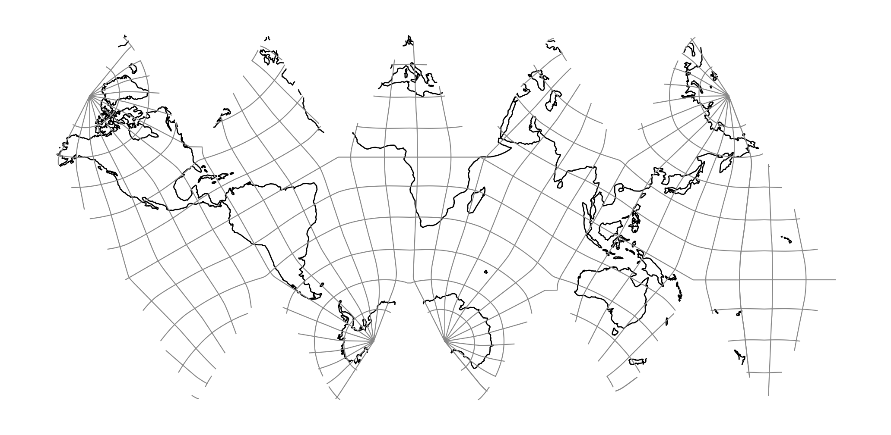
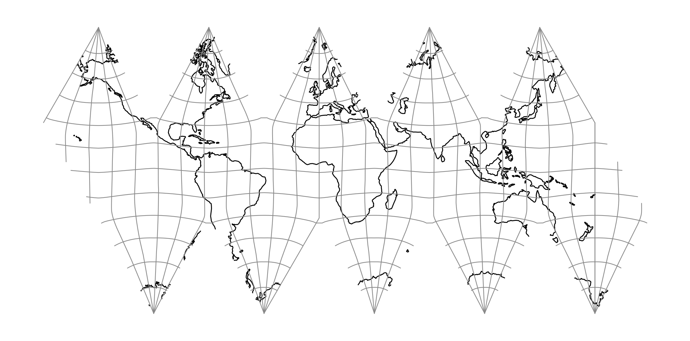

.. _ivea:

********************************************************************************
Icosahedral Vertex-oriented great circle Equal Area
********************************************************************************

.. versionadded:: 9.9

Alias for ``+proj=dsea +dual``. Drop-in improved version of :ref:`isea`, with
less obvious cusps. Functionally equivalent to performing a Snyder equal-area
projection using a dodecahedron (:ref:`dsea`), but then unfolding onto an
icosahedral net.

Snyder's equal-area mapping :cite:`Snyder1992` applied to the twelve pentagonal
faces of a regular dodecahedron. Each face is subdivided into 10 spherical right
sub-triangles, yielding a total of 120.

The icosahedron is unfolded into a planar net and subdivided into 20 × 6 = 120
right sub-triangles. Each sub-triangle is mapped independently using the
area-preserving Snyder construction to the 120 dodecahedral spherical triangles.

This is fully equivalent to using the icosahedron directly, but changing the
vertex from which the great circles originate from the center of the faces to
the vertices, described as the Vertex-oriented great circle projection in
:cite:`vanLeeuwen2006`.

See :ref:`polyhedral` for the shared theory.

+---------------------+----------------------------------------------------------+
| **Classification**  | Polyhedral, equal area                                   |
+---------------------+----------------------------------------------------------+
| **Available forms** | Forward and inverse, spherical and ellipsoidal           |
+---------------------+----------------------------------------------------------+
| **Defined area**    | Global                                                   |
+---------------------+----------------------------------------------------------+
| **Alias**           | ivea                                                     |
+---------------------+----------------------------------------------------------+
| **Domain**          | 2D                                                       |
+---------------------+----------------------------------------------------------+
| **Input type**      | Geodetic coordinates                                     |
+---------------------+----------------------------------------------------------+
| **Output type**     | Projected coordinates                                    |
+---------------------+----------------------------------------------------------+

   proj-string: ``+proj=ivea``

Orientations
################################################################################

``ivea`` ships a single net (Snyder's Figure 12, shown above). A second named
orientation is available via ``+orient=pole``, which places one icosahedron
vertex on the geographic north pole:

   proj-string: ``+proj=ivea +orient=pole``

Parameters
################################################################################

.. note::
    All parameters are optional.

.. option:: +orient=<name>

    Shorthand for two named orientations. Accepted values: ``isea``, ``pole``.
    Equivalent to setting ``+orient_lat`` / ``+orient_lon`` / ``+azi``
    explicitly; individual ``+orient_*`` parameters still override.

    *Defaults to* ``isea``.

.. include:: ../options/orient_lat.rst

*Defaults to ~58.40° geodetic (arctan(φ) ≈ 58.2825° authalic).*

.. include:: ../options/orient_lon.rst

*Defaults to 11.25° on a sphere, 11.20° on an ellipsoid.*

.. include:: ../options/azi_polyhedral.rst

*Defaults to 0.0.*

.. include:: ../options/lat_0_polyhedral.rst

.. include:: ../options/lon_0_polyhedral.rst

.. include:: ../options/x_0.rst

.. include:: ../options/y_0.rst

.. include:: ../options/ellps.rst

.. include:: ../options/R.rst
