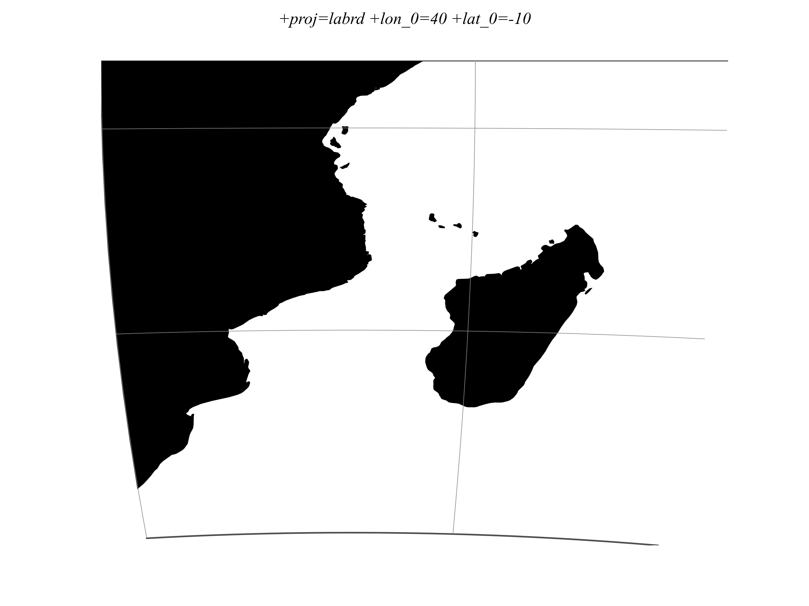

.. _labrd:

********************************************************************************
Laborde
********************************************************************************

+---------------------+----------------------------------------------------------+
| **Classification**  | Cylindrical                                              |
+---------------------+----------------------------------------------------------+
| **Available forms** | Forward and inverse, spherical and ellipsoidal           |
+---------------------+----------------------------------------------------------+
| **Defined area**    | Global, but more accurate around Madagascar              |
+---------------------+----------------------------------------------------------+
| **Alias**           | labrd                                                    |
+---------------------+----------------------------------------------------------+
| **Domain**          | 2D                                                       |
+---------------------+----------------------------------------------------------+
| **Input type**      | Geodetic coordinates                                     |
+---------------------+----------------------------------------------------------+
| **Output type**     | Projected coordinates                                    |
+---------------------+----------------------------------------------------------+

   proj-string: ``+proj=labrd +lon_0=40 +lat_0=-10``

Parameters
################################################################################

Required
--------------------------------------------------------------------------------

.. option:: +lat_0=<value>

    Latitude of projection center. Must not be zero.

Optional
--------------------------------------------------------------------------------

.. option:: +azi=<value>

    Azimuth of the central line.

    *Defaults to 0.0*

.. include:: ../options/lon_0.rst

.. include:: ../options/R.rst

.. include:: ../options/x_0.rst

.. include:: ../options/y_0.rst
