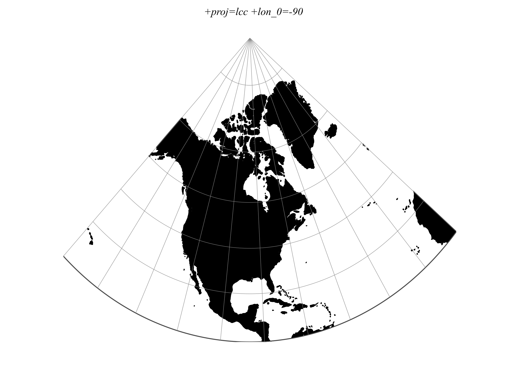

.. _lcc:

********************************************************************************
Lambert Conformal Conic
********************************************************************************

A Lambert Conformal Conic projection (LCC) is a conic map projection
used for aeronautical charts, portions of the State Plane Coordinate
System, and many national and regional mapping systems. It is one of
seven projections introduced by Johann Heinrich Lambert in 1772.

It has several different forms: with one and two standard parallels
(referred to as 1SP and 2SP in EPSG guidance notes). Additionally we
provide "2SP Michigan" form which is very similar to normal 2SP, but
with a scaling factor on the ellipsoid (given as `k_0` parameter).
It is implemented as per EPSG Guidance Note 7-2 (version 54, August
2018, page 25). It is used in a few systems in the EPSG database which
justifies adding this otherwise non-standard projection.

+---------------------+----------------------------------------------------------+
| **Classification**  | Conformal conic                                          |
+---------------------+----------------------------------------------------------+
| **Available forms** | Forward and inverse, spherical and elliptical projection.|
|                     | One or two standard parallels (1SP and 2SP).             |
|                     | "LCC 2SP Michigan" form can be used by setting           |
|                     | `+k_0` parameter to specify elliposid scale.             |
+---------------------+----------------------------------------------------------+
| **Defined area**    | Best for regions predominantly east–west in extent and   |
|                     | located in the middle north or south latitudes.          |
+---------------------+----------------------------------------------------------+
| **Alias**           | lcc                                                      |
+---------------------+----------------------------------------------------------+
| **Domain**          | 2D                                                       |
+---------------------+----------------------------------------------------------+
| **Input type**      | Geodetic coordinates                                     |
+---------------------+----------------------------------------------------------+
| **Output type**     | Projected coordinates                                    |
+---------------------+----------------------------------------------------------+

   proj-string: ``+proj=lcc +lon_0=-90 +lat_1=33 +lat_2=45``

Parameters
################################################################################

Required
--------------------------------------------------------------------------------

.. include:: ../options/lat_1.rst

Optional
--------------------------------------------------------------------------------

.. include:: ../options/lon_0.rst

.. include:: ../options/lat_0.rst

.. include:: ../options/lat_2.rst

.. include:: ../options/ellps.rst

.. include:: ../options/R.rst

.. include:: ../options/x_0.rst

.. include:: ../options/y_0.rst

.. option:: +k_0=<value>

    This parameter can represent two different values depending on the
    form of the projection. In LCC 1SP it determines the scale factor
    at natural origin. In LCC 2SP Michigan it determines the ellipsoid
    scale factor.

    *Defaults to 1.0.*

Further reading
###############

#. `Wikipedia <https://en.wikipedia.org/wiki/Lambert_conformal_conic_projection>`_
#. `Wolfram Mathworld <http://mathworld.wolfram.com/LambertConformalConicProjection.html>`_
#. `John P. Snyder "Map projections: A working manual" (pp. 104-110) <https://pubs.er.usgs.gov/publication/pp1395>`_
#. `ArcGIS documentation on "Lambert Conformal Conic" <http://desktop.arcgis.com/en/arcmap/10.3/guide-books/map-projections/lambert-conformal-conic.htm>`_
#. `EPSG Guidance Note 7-2 (version 54, August 2018, page 25) <http://www.epsg.org/Guidancenotes.aspx>`_
