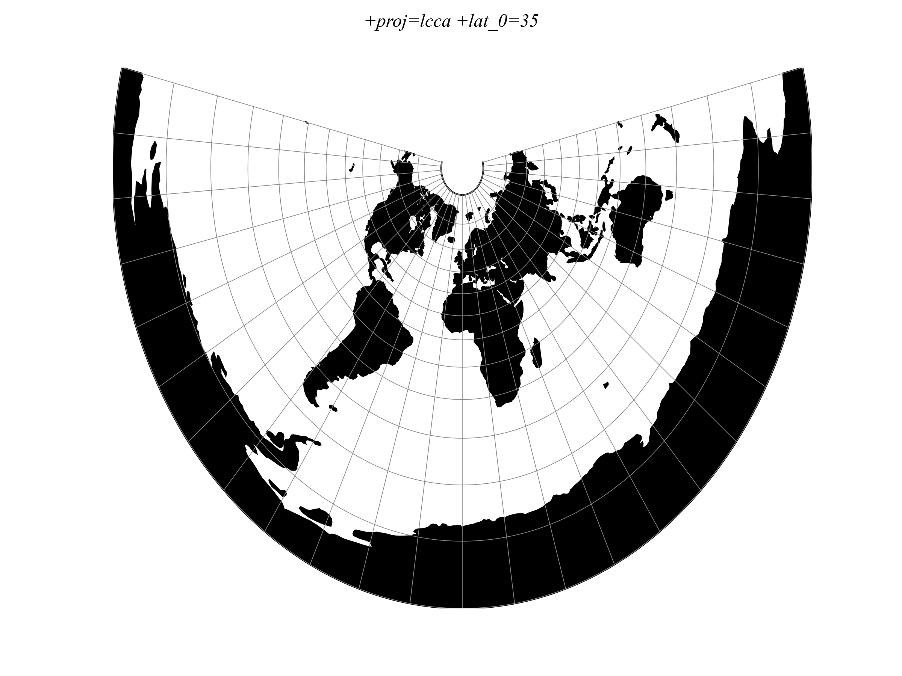

.. _lcca:

********************************************************************************
Lambert Conformal Conic Alternative
********************************************************************************

   proj-string: ``+proj=lcca +lat_0=35``

Parameters
################################################################################

.. note:: All parameters are optional for the projection.

.. include:: ../options/lon_0.rst

.. include:: ../options/lat_0.rst

.. include:: ../options/ellps.rst

.. include:: ../options/R.rst

.. include:: ../options/x_0.rst

.. include:: ../options/y_0.rst
