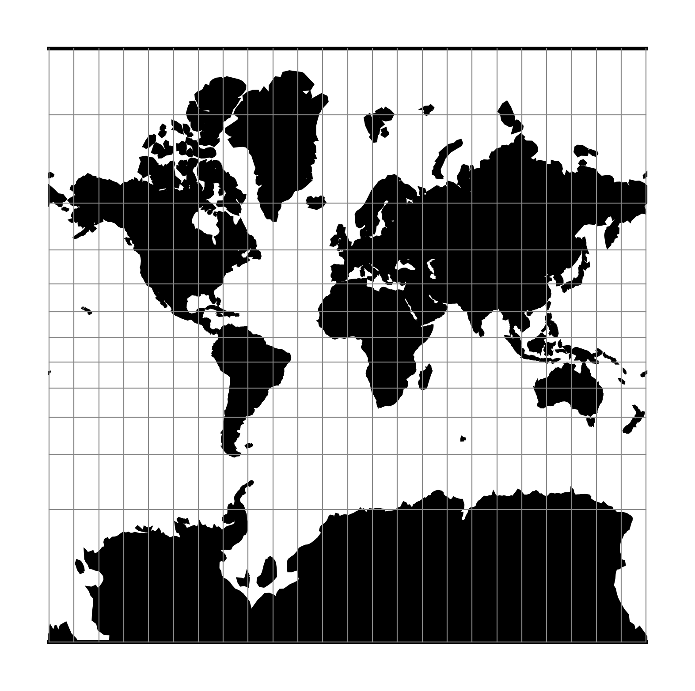

.. _merc:

********************************************************************************
Mercator
********************************************************************************

The Mercator projection is a cylindrical map projection that origins from the 15th
century. It is widely recognized as the first regularly used map projection.
The projection is conformal which makes it suitable for navigational purposes.

+---------------------+----------------------------------------------------------+
| **Classification**  | Conformal cylindrical                                    |
+---------------------+----------------------------------------------------------+
| **Available forms** | Forward and inverse, spherical and elliptical projection |
+---------------------+----------------------------------------------------------+
| **Defined area**    | Global, but best used near the equator                   |
+---------------------+----------------------------------------------------------+
| **Alias**           | merc                                                     |
+---------------------+----------------------------------------------------------+
| **Domain**          | 2D                                                       |
+---------------------+----------------------------------------------------------+
| **Input type**      | Geodetic coordinates                                     |
+---------------------+----------------------------------------------------------+
| **Output type**     | Projected coordinates                                    |
+---------------------+----------------------------------------------------------+

   proj-string: ``+proj=merc``

Usage
########

Applications should be limited to equatorial regions, but is frequently
used for navigational charts with latitude of true scale (:option:`+lat_ts`) specified within
or near chart's boundaries.
Often inappropriately used for world maps since the regions near the poles
cannot be shown :cite:`Evenden1995`.

Example using latitude of true scale::

    $ echo 56.35 12.32 | proj +proj=merc +lat_ts=56.5
    3470306.37    759599.90

Example using scaling factor::

    echo 56.35 12.32 | proj +proj=merc +k_0=2
    12545706.61     2746073.80

Note that :option:`+lat_ts` and :option:`+k_0` are mutually exclusive.
If used together, :option:`+lat_ts` takes precedence over :option:`+k_0`.

Parameters
################################################################################

.. note:: All parameters for the projection are optional.

.. include:: ../options/lat_ts.rst

.. include:: ../options/k_0.rst

.. include:: ../options/lon_0.rst

.. include:: ../options/x_0.rst

.. include:: ../options/y_0.rst

.. include:: ../options/ellps.rst

.. include:: ../options/R.rst

Mathematical definition
#######################

The formulas describing the Mercator projection are all taken from G. Evenden's libproj manuals :cite:`Evenden2005`.

Spherical form
**************
For the spherical form of the projection we introduce the scaling factor:

.. math::

    k_0 = \cos \phi_{ts}

Forward projection
==================

.. math::

    x = k_0 \lambda

.. math::

    y = k_0 \ln \left[ \tan \left(\frac{\pi}{4} + \frac{\phi}{2} \right) \right]

Inverse projection
==================

.. math::

    \lambda = \frac{x}{k_0}

.. math::

    \phi = \frac{\pi}{2} - 2 \arctan \left[ e^{-y/k_0} \right]

Elliptical form
***************

For the elliptical form of the projection we introduce the scaling factor:

.. math::

    k_0 = m\left( \phi_{ts} \right)

where :math:`m\left(\phi\right)` is the parallel radius at latitude :math:`\phi`.

We also use the Isometric Latitude kernel function :math:`t()`.

.. note::
    m() and t() should be described properly on a separate page about the theory of projections on the ellipsoid.

Forward projection
==================
.. math::

    x = k_0 \lambda

.. math::

    y = k_0 \ln t \left( \phi \right)

Inverse projection
==================

.. math::

    \lambda = \frac{x}{k_0}

.. math::

    \phi = t^{-1}\left[ e^{ -y/k_0 } \right]

Further reading
###############

#. `Wikipedia <https://en.wikipedia.org/wiki/Mercator_projection>`_
#. `Wolfram Mathworld <http://mathworld.wolfram.com/MercatorProjection.html>`_

