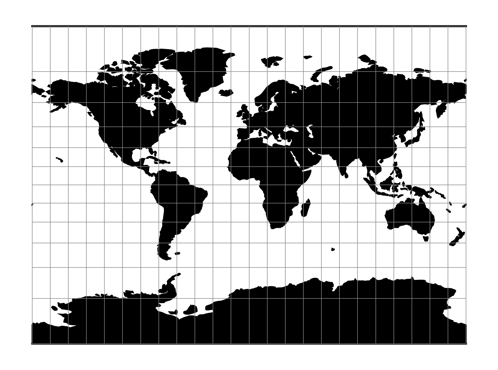

.. _mill:

********************************************************************************
Miller Cylindrical
********************************************************************************

The Miller cylindrical projection is a modified Mercator projection, proposed by Osborn Maitland Miller in 1942.
The latitude is scaled by a factor of :math:`\frac{4}{5}`, projected according to Mercator, and then the result is multiplied by :math:`\frac{5}{4}` to retain scale along the equator.

+---------------------+----------------------------------------------------------+
| **Classification**  | Neither conformal nor equal area cylindrical             |
+---------------------+----------------------------------------------------------+
| **Available forms** | Forward and inverse spherical                            |
+---------------------+----------------------------------------------------------+
| **Defined area**    | Global, but best used near the equator                   |
+---------------------+----------------------------------------------------------+
| **Alias**           | mill                                                     |
+---------------------+----------------------------------------------------------+
| **Domain**          | 2D                                                       |
+---------------------+----------------------------------------------------------+
| **Input type**      | Geodetic coordinates                                     |
+---------------------+----------------------------------------------------------+
| **Output type**     | Projected coordinates                                    |
+---------------------+----------------------------------------------------------+

Usage
########

The Miller Cylindrical projection is used for world maps and in several atlases,
including the National Atlas of the United States (USGS, 1970, p. 330-331) :cite:`Snyder1987`.

Example using Central meridian 90°W::

    $ echo -100 35 | proj +proj=mill +lon_0=90w
    -1113194.91      4061217.24

Parameters
################################################################################

.. note:: All parameters for the projection are optional.

.. include:: ../options/lon_0.rst

.. include:: ../options/R.rst

.. include:: ../options/x_0.rst

.. include:: ../options/y_0.rst

Mathematical definition
#######################

The formulas describing the Miller projection are all taken from :cite:`Snyder1987`.

Forward projection
==================

.. math::

    x = \lambda

.. math::

   y = 1.25 * \ln \left[ \tan \left(\frac{\pi}{4} + 0.4 * \phi \right) \right]

Inverse projection
==================

.. math::

    \lambda = x

.. math::

    \phi = 2.5 * ( \arctan \left[ e^{0.8 * y} \right] - \frac{\pi}{4}  )

Further reading
###############

#. `Wikipedia <https://en.wikipedia.org/wiki/Miller_cylindrical_projection>`_

