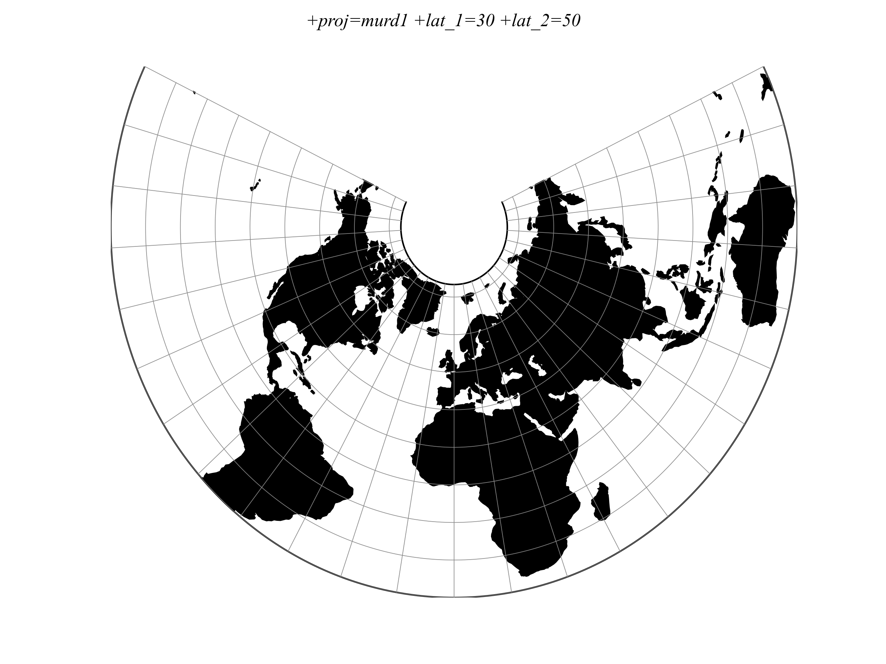

.. _murd1:

********************************************************************************
Murdoch I
********************************************************************************

+---------------------+----------------------------------------------------------+
| **Classification**  | Conical                                                  |
+---------------------+----------------------------------------------------------+
| **Available forms** | Forward and inverse, spherical projection                |
+---------------------+----------------------------------------------------------+
| **Defined area**    | Global                                                   |
+---------------------+----------------------------------------------------------+
| **Alias**           | murd1                                                    |
+---------------------+----------------------------------------------------------+
| **Domain**          | 2D                                                       |
+---------------------+----------------------------------------------------------+
| **Input type**      | Geodetic coordinates                                     |
+---------------------+----------------------------------------------------------+
| **Output type**     | Projected coordinates                                    |
+---------------------+----------------------------------------------------------+

   proj-string: ``+proj=murd1 +lat_1=30 +lat_2=50``

Parameters
################################################################################

Required
--------------------------------------------------------------------------------

.. include:: ../options/lat_1.rst

.. include:: ../options/lat_2.rst

Optional
--------------------------------------------------------------------------------

.. include:: ../options/lon_0.rst

.. include:: ../options/R.rst

.. include:: ../options/x_0.rst

.. include:: ../options/y_0.rst
