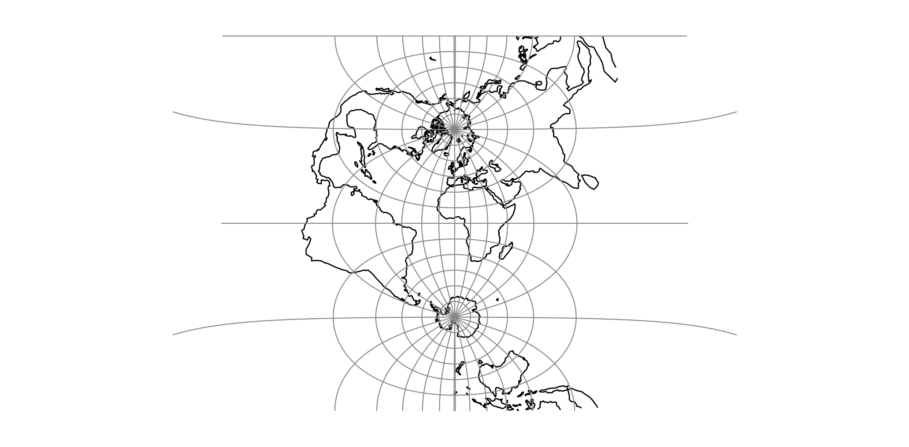

.. _omerc:

********************************************************************************
Oblique Mercator
********************************************************************************

The Oblique Mercator projection is a cylindrical map projection that closes the
gap between the Mercator and the Transverse Mercator projections.

+---------------------+----------------------------------------------------------+
| **Classification**  | Conformal cylindrical                                    |
+---------------------+----------------------------------------------------------+
| **Available forms** | Forward and inverse, spherical and elliptical projection |
+---------------------+----------------------------------------------------------+
| **Defined area**    | Global, but reasonably accurate only within 15 degrees   |
|                     | of the oblique central line                              |
+---------------------+----------------------------------------------------------+
| **Alias**           | omerc                                                    |
+---------------------+----------------------------------------------------------+
| **Domain**          | 2D                                                       |
+---------------------+----------------------------------------------------------+
| **Input type**      | Geodetic coordinates                                     |
+---------------------+----------------------------------------------------------+
| **Output type**     | Projected coordinates                                    |
+---------------------+----------------------------------------------------------+

   proj-string: ``+proj=omerc +lat_1=45 +lat_2=55``

Figuratively, the cylinder used for developing the Mercator projection touches
the planet along the Equator, while that of the Transverse Mercator touches the
planet along a meridian, i.e. along a line perpendicular to the Equator.

The cylinder for the Oblique Mercator, however, touches the planet along a line
at an arbitrary angle with the Equator. Hence, the Oblique Mercator projection
is useful for mapping areas having their greatest extent along a direction that
is neither north-south, nor east-west.

The Mercator and the Transverse Mercator projections are both limiting forms of
the Oblique Mercator: The Mercator projection is equivalent to an Oblique Mercator
with central line along the Equator, while the Transverse Mercator is equivalent
to an Oblique Mercator with central line along a meridian.

For the sphere, the construction of the Oblique Mercator projection can be
imagined as "tilting the cylinder of a plain Mercator projection",
so the cylinder, instead of touching the equator, touches an arbitrary great circle
on the sphere. The great circle is defined by the tilt angle of the central line,
hence putting land masses along that great circle near the centre of the map,
where the Equator would go in the plain Mercator case.

The ellipsoidal case, developed by Hotine, and refined by Snyder  :cite:`Snyder1987`
is more complex, involving initial steps projecting from the ellipsoid to another
curved surface, the "aposphere", then projection from the aposphere to the skew
uv-plane, before finally rectifying the skew uv-plane onto the map XY plane.

Usage
########

The tilt angle (azimuth) of the central line can be given in two different ways.
In the first case, the azimuth is given directly, using the option :option:`+alpha`
and defining the centre of projection using the options :option:`+lonc` and
:option:`+lat_0`.
In the second case, the azimuth is given indirectly by specifying two points on
the central line, using the options
:option:`+lat_1`, :option:`+lon_1`, :option:`+lat_2`, and :option:`+lon_2`.

Example: Verify that the Mercator projection is a limiting form of the Oblique
Mercator

::

    $ echo 12 55 | proj +proj=merc +ellps=GRS80
    1335833.89   7326837.71

    $ echo 12 55 | proj +proj=omerc +lonc=0 +alpha=90 +ellps=GRS80
    1335833.89   7326837.71

Example: Second case - indirectly given azimuth

::

    $ echo 12 55 | proj +proj=omerc +lon_1=-1 +lat_1=1 +lon_2=0 +lat_2=0 +ellps=GRS80
      349567.57   6839490.50

Example: An approximation of the Danish "System 34" from :cite:`Rittri2012`

::

    $ echo 10.536498003 56.229892362 | proj +proj=omerc +axis=wnu +lonc=9.46 +lat_0=56.13333333 +x_0=-266906.229 +y_0=189617.957 +k=0.9999537 +alpha=-0.76324 +gamma=0 +ellps=GRS80
    200000.13   199999.89

The input coordinate represents the System 34 datum point "Agri Bavnehoj", with coordinates
(200000, 200000) by definition. So at the datum point, the approximation is off by about 17 cm.
This use case represents a datum shift from a cylinder projection on an old, slightly
misaligned datum, to a similar projection on a modern datum.

Parameters
################################################################################

Central point and azimuth method
--------------------------------------------------------------------------------

.. option:: +alpha=<value>

    Azimuth of centerline clockwise from north at the center point of the line.
    If :option:`+gamma` is not given then :option:`+alpha` determines the value of
    :option:`+gamma`.

.. option:: +gamma=<value>

    Azimuth of centerline clockwise from north of the rectified
    bearing of centre line. If :option:`+alpha` is not given, then
    :option:`+gamma` is used to determine :option:`+alpha`.

.. option:: +lonc=<value>

    Longitude of the central point.

.. option:: +lat_0=<value>

    Latitude of the central point.

Two point method
--------------------------------------------------------------------------------

.. option:: +lon_1=<value>

    Longitude of first point.

.. option:: +lat_1=<value>

    Latitude of first point.

.. option:: +lon_2=<value>

    Longitude of second point.

.. option:: +lat_2=<value>

    Latitude of second point.

Optional
--------------------------------------------------------------------------------

.. option:: +no_rot

    No rectification (not "no rotation" as one may well assume).
    Do not take the last step from the skew uv-plane to the map
    XY plane.
    
    .. note:: This option is probably only marginally useful, but remains for (mostly) historical reasons.

.. option:: +no_off

    Do not offset origin to center of projection.

.. include:: ../options/k_0.rst

.. include:: ../options/lon_0.rst

.. include:: ../options/x_0.rst

.. include:: ../options/y_0.rst
