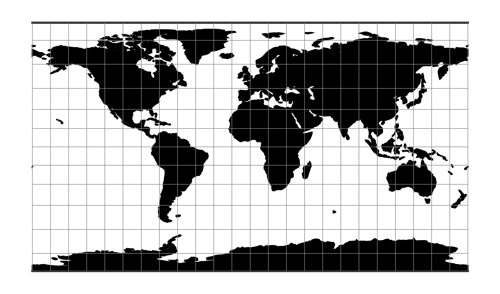

.. _patterson:

********************************************************************************
Patterson
********************************************************************************

The Patterson projection is a cylindrical map projection designed for
general-purpose mapmaking.

See :cite:`Patterson2014`

+---------------------+----------------------------------------------------------+
| **Classification**  | Cylindrical                                              |
+---------------------+----------------------------------------------------------+
| **Available forms** | Forward and inverse, spherical projection                |
+---------------------+----------------------------------------------------------+
| **Defined area**    | Global                                                   |
+---------------------+----------------------------------------------------------+
| **Alias**           | patterson                                                |
+---------------------+----------------------------------------------------------+
| **Domain**          | 2D                                                       |
+---------------------+----------------------------------------------------------+
| **Input type**      | Geodetic coordinates                                     |
+---------------------+----------------------------------------------------------+
| **Output type**     | Projected coordinates                                    |
+---------------------+----------------------------------------------------------+

   proj-string: ``+proj=patterson``

Parameters
################################################################################

.. note:: All parameters are optional for projection.

.. include:: ../options/lon_0.rst

.. include:: ../options/R.rst

.. include:: ../options/x_0.rst

.. include:: ../options/y_0.rst
