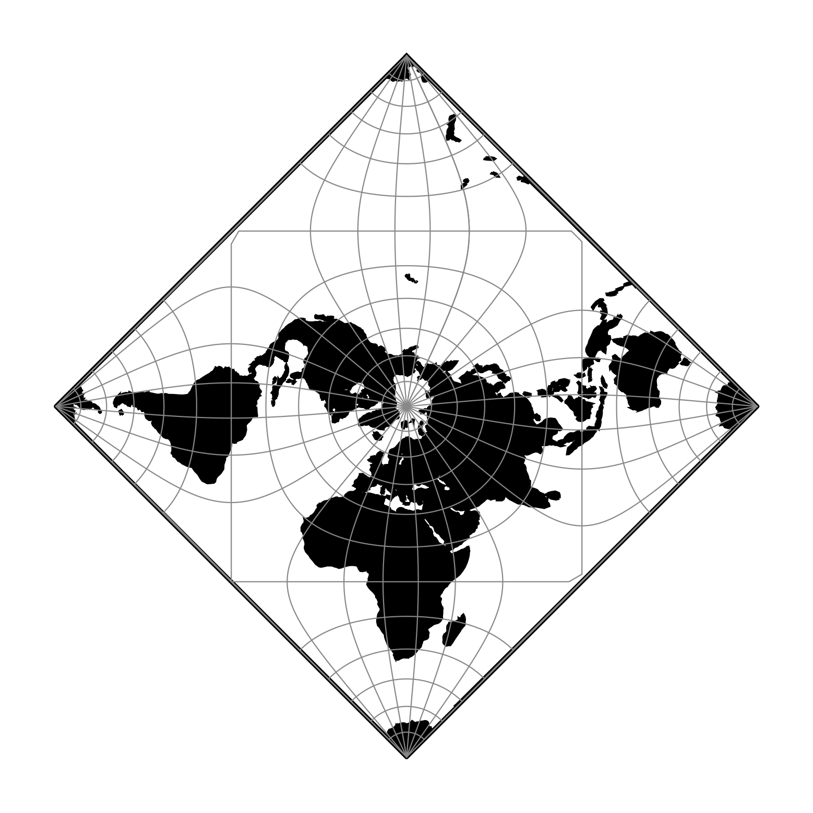

.. _peirce_q_d:

********************************************************************************
Peirce Quincuncial (Diamond)
********************************************************************************

The Peirce Quincuncial projection is a conformal map projection
that transforms the circle of the northern hemisphere into a square,
and the southern hemisphere split into four triangles arranged
around the square to form a quincunx. The resulting projection
is a regular diamond shape that is usually rotated 45 degrees to form a square.
The resulting tile can be infinitely tessellated. Though this implementation
defaults to a central meridian of 0, it is more common to use a central
meridian of around 25 to optimise the distortions. Peirce's original
published map from 1879 used a central meridian of approx -70.

Use Peirce Quincuncial (Square) to rotate diamond to a square.

+---------------------+----------------------------------------------------------+
| **Classification**  | Miscellaneous                                            |
+---------------------+----------------------------------------------------------+
| **Available forms** | Forward spherical projection                             |
+---------------------+----------------------------------------------------------+
| **Defined area**    | Global                                                   |
+---------------------+----------------------------------------------------------+
| **Alias**           | peirce_q_d                                                 |
+---------------------+----------------------------------------------------------+
| **Domain**          | 2D                                                       |
+---------------------+----------------------------------------------------------+
| **Input type**      | Geodetic coordinates                                     |
+---------------------+----------------------------------------------------------+
| **Output type**     | Projected coordinates                                    |
+---------------------+----------------------------------------------------------+

   proj-string: ``+proj=peirce_q_d +lon_0=25``

Parameters
################################################################################

.. note:: All parameters are optional.

.. include:: ../options/lon_0.rst

.. include:: ../options/R.rst

.. include:: ../options/x_0.rst

.. include:: ../options/y_0.rst
