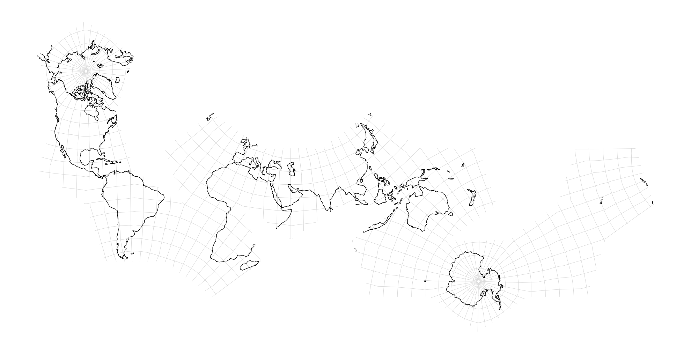
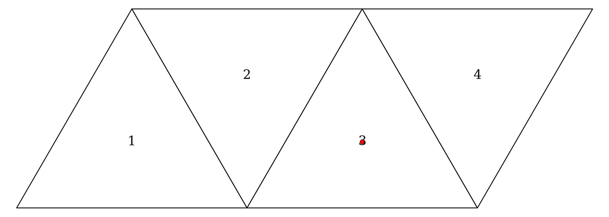

.. _polyhedral:

********************************************************************************
Polyhedral Snyder Equal Area
********************************************************************************

The polyhedral Snyder equal-area projection maps the sphere onto the faces of
a polyhedron using the method described in :cite:`Snyder1992`. The projection
is area-preserving and supports both forward and inverse transforms on either
a sphere or an ellipsoid (input geodetic latitudes are converted to authalic
latitudes internally so the equal-area property is preserved).

The implementation is generic: each polyhedral face is subdivided into right
sub-triangles, Snyder's equal-area mapping is applied independently on each
sub-triangle, and the planar results are laid out according to a *net* — a
2D unfolding of the polyhedron.

Three projection aliases are registered:

- :ref:`tsea` — Tetrahedral Snyder Equal Area
- :ref:`dsea` — Dodecahedral Snyder Equal Area
- :ref:`isea` — Icosahedral Snyder Equal Area

Triangles
********************************************************************************

At its core, the projection is an area-preserving mapping from a spherical
right triangle ABC to a planar right triangle XYZ. Both triangles have one
distinguished vertex — the *apex* — which is listed first in either triple:
A on the sphere, X in the plane. The apex is shared by the sub-triangles
that fan out from a single face centre, so the sub-triangles meeting at the
apex tile a complete polyhedral face.

The planar triangles can be chosen with any consistent shape, as long as the
edges around the shared apex match the way the corresponding edges meet on
the sphere. The freedom in choosing this planar shape — together with the
freedom in choosing how to glue the faces together — is what defines a
*net*.

Polyhedra and nets
********************************************************************************

Each polyhedral projection is built from two compact definitions:

- A *polyhedron*: a list of 3D vertices on the unit sphere plus a list of
  face vertex indices (CCW from outside). By convention the first vertex is
  always `{0, 0, 1}`
- A *net*: a parent tree over the faces. The indexing is 1-based, with `0`
  reserved as the marker for the root face (that which has no parent).
  For example, `{2, 3, 0, 3}` means:
   - the 1st face has the **2nd face** as its parent
   - the 2nd face has the **3rd face** as its parent
   - the 3rd face has the **no face** as its parent (root)
   - the 4th face has the **3rd face** as its parent

Projection specifications
********************************************************************************

Because the planar layout is decoupled from the spherical triangulation, the
same polyhedron can be unfolded into several different nets, which can be
selected by name using the `+net` parameter, e.g. `+proj=tsea +net=star`

The defaults for ``+orient_lat`` / ``+orient_lon`` / ``+azi`` rotate each
polyhedron into a sensible default pose (e.g. centred on Europe / Africa for
``dsea``; matching Snyder's published Figure 12 for ``isea``). When
``+lat_0`` / ``+lon_0`` are not supplied, the projected origin (0, 0) lands
on the centroid of the unfold's root face — except for ``isea``, which
uses the bounding-box centre of the root face instead so the unfolded net
sits centred in the output.

Parameters
********************************************************************************

.. note::
    All parameters are optional. Each polyhedral projection ships with a
    default orientation that places its vertices in symmetric, well-known
    positions; the parameters below override that default.

.. option:: +net=<name>

    Selects the planar unfolding (net).

    The accepted values and defaults depend on the projection

.. include:: ../options/orient_lat.rst

.. include:: ../options/orient_lon.rst

.. include:: ../options/azi.rst

.. include:: ../options/lat_0_polyhedral.rst

.. include:: ../options/lon_0_polyhedral.rst

.. include:: ../options/x_0.rst

.. include:: ../options/y_0.rst

.. include:: ../options/ellps.rst

.. include:: ../options/R.rst
