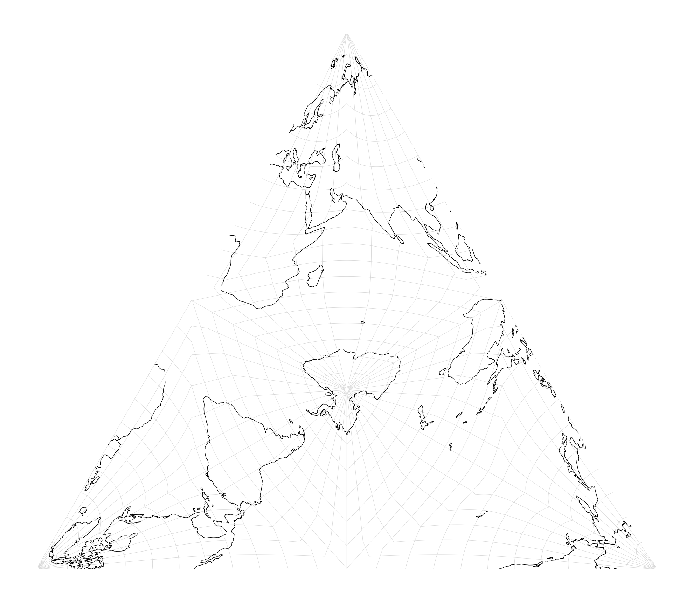
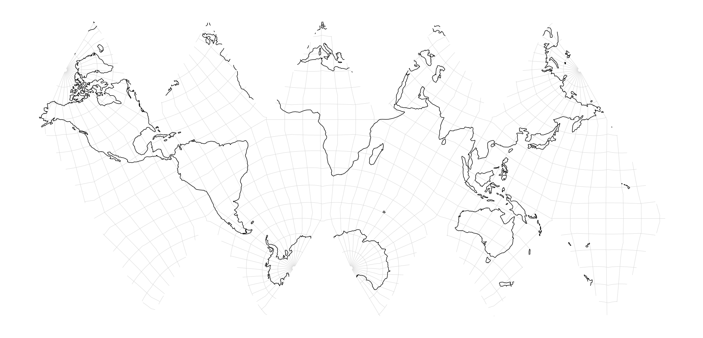
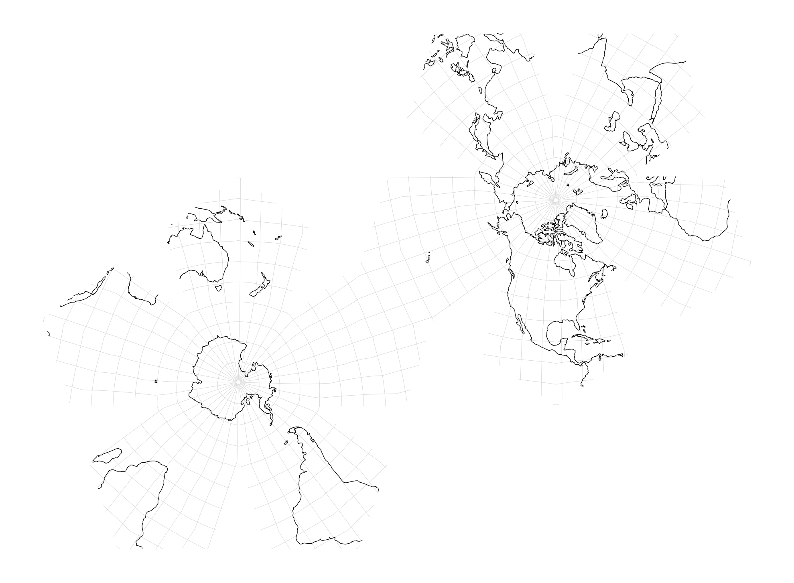
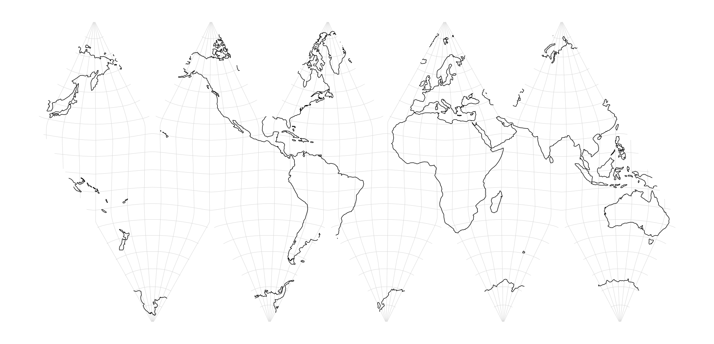

.. _polyhedral:

********************************************************************************
Polyhedral Snyder Equal Area
********************************************************************************

.. figure:: ./images/polyhedral_title.png
   :width: 800 px
   :align: center
   :alt:   Polyhedral projection (DSEA A5)

The polyhedral Snyder equal-area projection maps the sphere onto the faces of a
polyhedron using the method described in :cite:`Snyder1992`. The projection is
area-preserving and supports both forward and inverse transforms.

The implementation is general: any polyhedron whose faces can be decomposed into
right triangles can be used. Each right triangle is independently projected
using Snyder's equal-area mapping between a spherical right triangle and a planar
triangle, then placed according to a *net* — a 2D unfolding of the polyhedron.

Triangles
********************************************************************************

At its core, the projection defines a generic method of transforming a spherical
right triangle ABC to a planar triangle XYZ, in an area-preserving manner.

Both spherical and planar triangles ABC have one special vertex, that we call
the apex. By convention we choose this to come first, so for the spherical
triangle it will be vertex A, while for the planar triangle vertex X.

The planar triangles can be chosen to have any shape (as long as they are all the
same). When unfolded into a net, the edges must map in the same way as the edges
of the spherical triangles, but the choice of which edges to keep is free.

Polyhedra definitions
********************************************************************************

A straightforward way to obtain spherical right triangles is to take a spherical
polyhedron and apply the akisation operation, forming triangles by connecting:
face center (apex), face vertex and edge midpoint.

An example is taking a tetrahedron, and cutting each of its 4 triangular faces
into 6 right triangles. The result is a hexakis tetrahedron, with 24 faces.

By defining polyhedra in this manner we can describe both the geometry of the
solid, as well as making clear which of the vertices should be treated as the
apex. For example, if we take the regular icosahedral and dodecahedron, and
apply the akisation described above to both we get the same 120 vertices, but
we can distinguish between the shapes:

- Hexakis icosahedron (20 triangular faces, cut into 6)
- Decakis dodecahedron (12 triangular faces, cut into 10)

It is important to note that the choice of polyhedron defines the projection
used, because it uniquely specifies the collection of triangles *and* the
apex vertices.

Net mapping
********************************************************************************

Internally, the projection outputs triangles in barycentric coordinates, which
are then be transformed into triangles on a 2D plane. Here is ``tsea``,
projecting the 24 faces of the hexakis tetrahedron into triangular net.

While it feels natural to project onto the net of the unfolded polyhedron, e.g.

- **Hexakis Icosahedron** onto **Icosahedron Net**
- **Decakis Dodecahedron** onto **Dodecahedron Net**

we can equally we unfold onto any net that has the same symmetry group (in other
words, shares the same set of triangles). So it is completely valid to unfold:

- **Hexakis Icosahedron** onto **Dodecahedron Net**
- **Decakis Dodecahedron** onto **Icosahedron Net**

Projection specifications
********************************************************************************

Most users will simply want to use a projection of their choosing and not worry
about the details of polyhedrons.

For this, several aliases are chosen for the projection string name, matching
the convention set by the ISEA projection, short for **Icosahedral Snyder
Equal Area**.

- ``tsea`` **Tetrahedral Snyder Equal Area**: Hexakis Tetrahedron (24 triangles)
- ``dsea`` **Dodecahedral Snyder Equal Area**: Decakis Dodecahedron (120 triangles)
- ``isea2`` **Icosahedral Snyder Equal Area**: Hexakis Icosahedron (120 triangles)

(Note ``isea2`` can be renamed to ``isea`` if it replaces the existing implementation)

When choosing projection, a set of nets is made available to the user by name.
The nets are tied to the projection, as the order of the triangles are important.
The net parameter can be omitted to use the default net.

Examples:

   proj-string: ``+proj=tsea``

   proj-string: ``+proj=isea2``

   proj-string: ``+proj=dsea +net=two_flower``

   proj-string: ``+proj=dsea +net=icosahedron``
