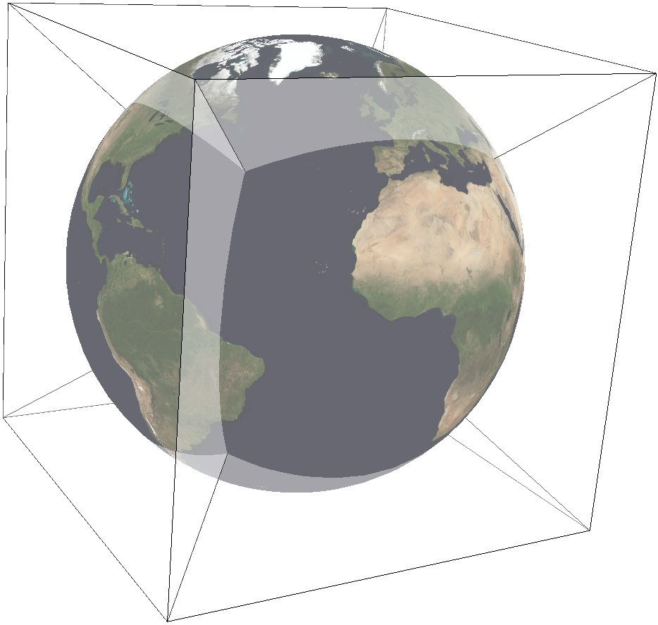

.. _s2:

********************************************************************************
S2
********************************************************************************

+---------------------+----------------------------------------------------------+
| **Classification**  | Miscellaneous                                            |
+---------------------+----------------------------------------------------------+
| **Available forms** | Forward and inverse, ellipsoidal                         |
+---------------------+----------------------------------------------------------+
| **Defined area**    | Global                                                   |
+---------------------+----------------------------------------------------------+
| **Alias**           | s2                                                       |
+---------------------+----------------------------------------------------------+
| **Domain**          | 2D                                                       |
+---------------------+----------------------------------------------------------+
| **Input type**      | Geodetic coordinates                                     |
+---------------------+----------------------------------------------------------+
| **Output type**     | Projected coordinates                                    |
+---------------------+----------------------------------------------------------+

.. versionadded:: 8.2

The S2 projection, like the Quadrilateralized Spherical Cube (QSC) projection, projects
a sphere surface onto the six sides of a cube:

S2 was created by Google to represent geographic data on the whole earth. The documentation can be found
at `S2 Geometry <https://s2geometry.io/>`_  It works by first
projecting a point on the sphere to a face of the cube. These are called u,v-coordinates, and they are in [-1,1] x [-1,1].
This step is followed by a non-linear transformation to normalize the area of rectangles on the sphere. There are three
different choices available for this transformation, meaning that S2 is a family of projections. The final output is in
s,t-coordinates, which are in [0,1] x [0,1].
See the comments in `S2 Code <https://github.com/google/s2geometry/blob/0c4c460bdfe696da303641771f9def900b3e440f/src/s2/s2coords.h#L226>`_
for an explanation of the tradeoff between speed and area-preservation. Note that the projection is azimuthal when "none" or
"linear" is selected for the area-normalization, but it is not azimuthal when "quadratic" or "tangent" is chosen. See 
S2's `Earthcube page <https://s2geometry.io/resources/earthcube>`_
to visualize the unfolded cube and the orientation of each face.

In this implementation, the cube side is selected by choosing one of the following six projection centers:

+-------------------------+--------------------+
| ``+lat_0=0 +lon_0=0``   | front cube side    |
+-------------------------+--------------------+
| ``+lat_0=0 +lon_0=90``  | right cube side    |
+-------------------------+--------------------+
| ``+lat_0=0 +lon_0=180`` | back cube side     |
+-------------------------+--------------------+
| ``+lat_0=0 +lon_0=-90`` | left cube side     |
+-------------------------+--------------------+
| ``+lat_0=90``           | top cube side      |
+-------------------------+--------------------+
| ``+lat_0=-90``          | bottom cube side   |
+-------------------------+--------------------+

The specific transformation can be chosen with the UVtoST parameter:

+-------------------------+-----------------------------+
|   ``+UVtoST=linear``    | fastest, no normalization   |
+-------------------------+-----------------------------+
| ``+UVtoST=quadratic``   | fast, good normalization    |
+-------------------------+-----------------------------+
|  ``+UVtoST=tangent``    | slowest, best normalization |
+-------------------------+-----------------------------+
|    ``+UVtoST=none``     | returns u,v-coordinates     |
+-------------------------+-----------------------------+

Furthermore, this implementation allows the projection to be applied to ellipsoids.
A preceding shift to a sphere is performed automatically; see :cite:`LambersKolb2012` for details.
The output of the projection is in s,t-coordinates ([0,1] x [0,1]), so only the
eccentricity of the ellipse is taken into account: the absolute value of the axes does
not affect the output.

Usage
###############################################################################

The following example uses S2 on the right face::

    echo 90 0 | ../bin/proj +proj=s2 +lat_0=0 +lon_0=90 +ellps=WGS84 +UVtoST=linear 

    0.5 0.5

Explanation:

* S2 projection is selected with ``+proj=s2``.
* The WGS84 ellipsoid is specified with ``+ellps=WGS84``.
* The cube side is selected with ``+lat_0=... +lon_0=...``.
* The normalization transformation is selected with ``+UVtoST=...``.

Parameters
################################################################################

.. note:: All parameters for the projection are optional.

.. include:: ../options/lon_0.rst

.. include:: ../options/lat_0.rst

.. include:: ../options/ellps.rst

.. option:: +UVtoST=<value>

    The area-normalization transformation. Choose from {linear, quadratic, tangent, none}

    *Defaults to "quadratic".*

.. include:: ../options/x_0.rst

.. include:: ../options/y_0.rst

Further reading
################################################################################

#. `S2's Website <https://s2geometry.io/>`_
