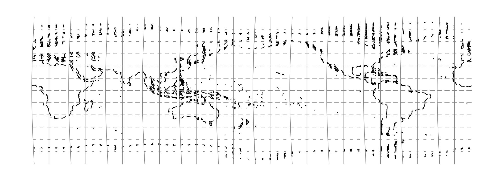

.. _tmerczoned:

********************************************************************************
Transverse Mercator Zoned Grid System
********************************************************************************

+---------------------+----------------------------------------------------------+
| **Classification**  | Miscellaneous                                            |
+---------------------+----------------------------------------------------------+
| **Available forms** | Forward and inverse, spherical and ellipsoidal           |
+---------------------+----------------------------------------------------------+
| **Defined area**    | Global                                                   |
+---------------------+----------------------------------------------------------+
| **Alias**           | tmerczoned                                               |
+---------------------+----------------------------------------------------------+
| **Domain**          | 2D                                                       |
+---------------------+----------------------------------------------------------+
| **Input type**      | Geodetic coordinates                                     |
+---------------------+----------------------------------------------------------+
| **Output type**     | Projected coordinates                                    |
+---------------------+----------------------------------------------------------+

   proj-string: ``+proj=tmerczoned +width=6``

From :cite:`IOGP2018`:

    A means of creating a grid system over a large area but also
    limiting distortion is to have several grid zones with most defining parameters being made common.
    Coordinates throughout the system are repeated in each zone. To make coordinates unambiguous the easting
    is prefixed by the relevant zone number. This procedure was adopted by German mapping in the 1930’s
    through the Gauss-Kruger systems and later by American military mapping through the Universal Transverse
    Mercator (or UTM) grid system.

Parameters
################################################################################

.. include:: ../options/lat_0.rst

.. option:: +lon_0=<value>

    Defines the initial longitude which is the the western limit of zone 1.

.. option:: +width=<value>

    Defines the width of each zone

.. include:: ../options/k_0.rst

.. include:: ../options/x_0.rst

.. include:: ../options/y_0.rst
