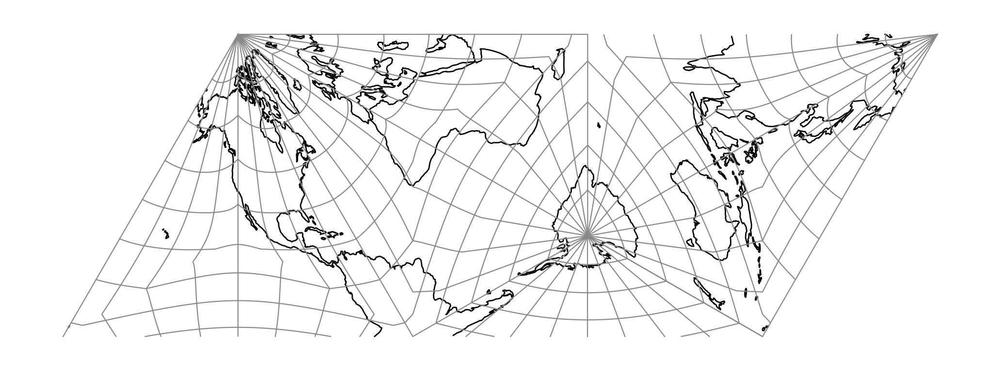
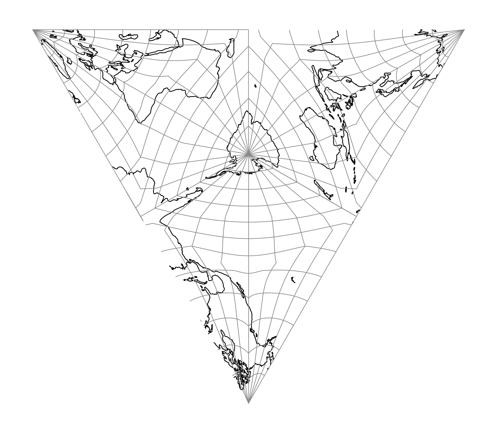

.. _tsea:

********************************************************************************
Tetrahedral Snyder Equal Area
********************************************************************************

.. versionadded:: 9.9

Snyder's equal-area mapping :cite:`Snyder1992` applied to the four faces of a
regular tetrahedron and unfolded into a planar net.

The tetrahedron is subdivided into 4 × 6 = 24 right sub-triangles, and each
sub-triangle is mapped independently using the area-preserving Snyder
construction.

See :ref:`polyhedral` for the shared theory.

+---------------------+----------------------------------------------------------+
| **Classification**  | Polyhedral, equal area                                   |
+---------------------+----------------------------------------------------------+
| **Available forms** | Forward and inverse, spherical and ellipsoidal           |
+---------------------+----------------------------------------------------------+
| **Defined area**    | Global                                                   |
+---------------------+----------------------------------------------------------+
| **Alias**           | tsea                                                     |
+---------------------+----------------------------------------------------------+
| **Domain**          | 2D                                                       |
+---------------------+----------------------------------------------------------+
| **Input type**      | Geodetic coordinates                                     |
+---------------------+----------------------------------------------------------+
| **Output type**     | Projected coordinates                                    |
+---------------------+----------------------------------------------------------+

   proj-string: ``+proj=tsea``

Nets
################################################################################

The default net (shown above) follows Snyder's Figure 8. An alternative
``+net=star`` layout is also available:

   proj-string: ``+proj=tsea +net=star``

In the ``star`` layout the south-cap face sits at the centre, with its three
neighbours fanned around it.

Parameters
################################################################################

.. note::
    All parameters are optional.

.. option:: +net=<name>

    Selects the planar unfolding. Accepted values: ``tsea``, ``star``.

    *Defaults to* ``tsea``.

.. include:: ../options/orient_lat.rst

*Defaults to 90.0.*

.. include:: ../options/orient_lon.rst

*Defaults to 0.0.*

.. include:: ../options/azi.rst

*Defaults to 0.0.*

.. include:: ../options/lat_0_polyhedral.rst

.. include:: ../options/lon_0_polyhedral.rst

.. include:: ../options/x_0.rst

.. include:: ../options/y_0.rst

.. include:: ../options/ellps.rst

.. include:: ../options/R.rst
