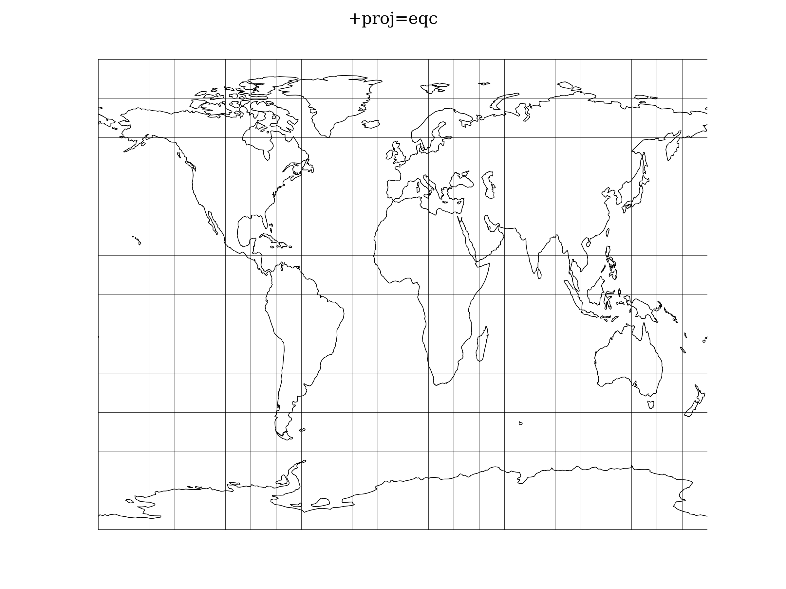

.. _eqc:

********************************************************************************
Equidistant Cylindrical (Plate Caree)
********************************************************************************

Marinus of Tyre was attributed this equirectangular projection :

.. math::

   x = (\lambda - \lambda0) cos \phi0 

.. math::

   y = \phi - \phi0

.. math::

   (\phi0, \lambda0) = the center of the map

Reverse operation :

.. math::

   \lambda = x / cos \phi0 + \lambda0

.. math::

   \phi = y + \phi0

.. math::

   (\phi0, \lambda0) = the center of the map

