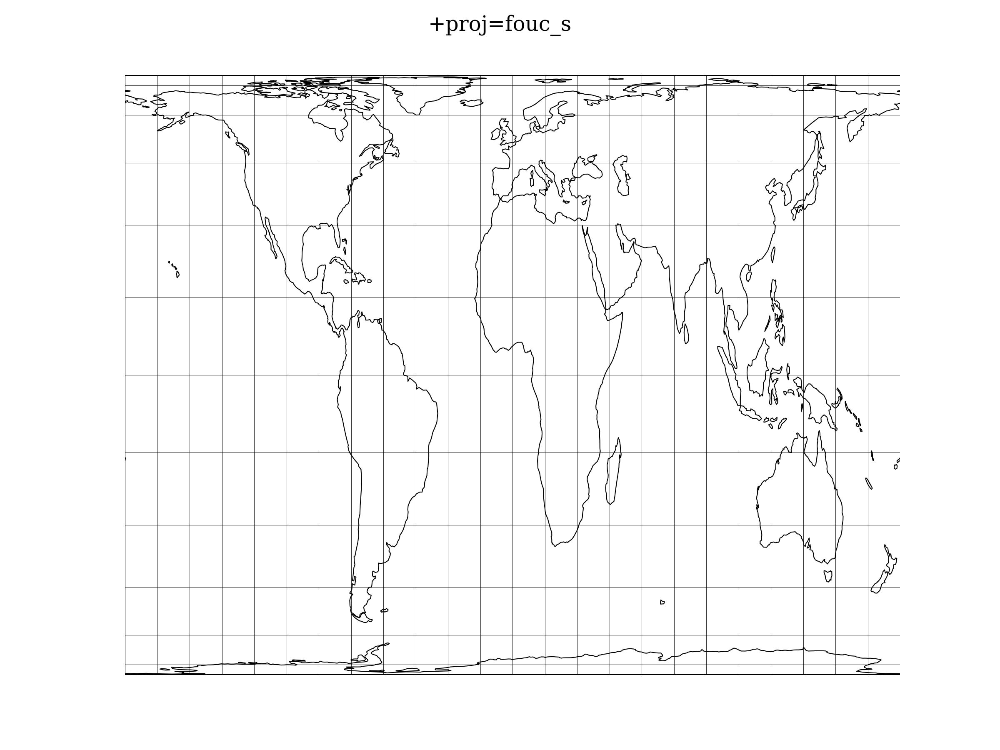

.. _fouc_s:

********************************************************************************
Foucaut Sinusoidal
********************************************************************************

The `y`-axis is based upon a weighted mean of the cylindrical equal-area and
the sinusoidal projections. Parameter :math:`n=n` is the weighting factor where
:math:`0 <= n <= 1`.

.. math::

    \begin{array}

    x &= \lambda \cos \phi / (n + (1 - n) \ cos \phi)

    y &= n \phi + (1 - n) \sin \phi

    \end {array}

For the inverse, the Newton-Raphson method can be used to determine
:math:`\phi` from the equation for :math:`y` above. As :math:`n -> 0` and
:math:`\phi -> \pi/2`, convergence is slow but for :math:`n = 0`, :math:`\phi =
\sin^1y`
