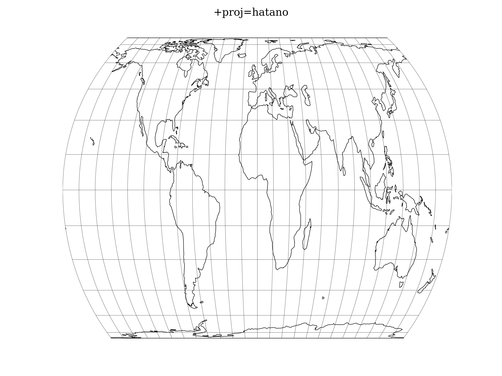

.. _hatano:

********************************************************************************
Hatano Asymmetrical Equal Area
********************************************************************************

.. math::

   \begin{array}

   x &= 0.85\lambda cos \theta

   y &= C_y sin \theta

   P(\theta) &= 2\theta + sin 2\theta - C_p sin \phi

   P'(\theta) &= 2(1 + cos 2\theta)

   \theta_0 &= 2\phi

   \end{array}

