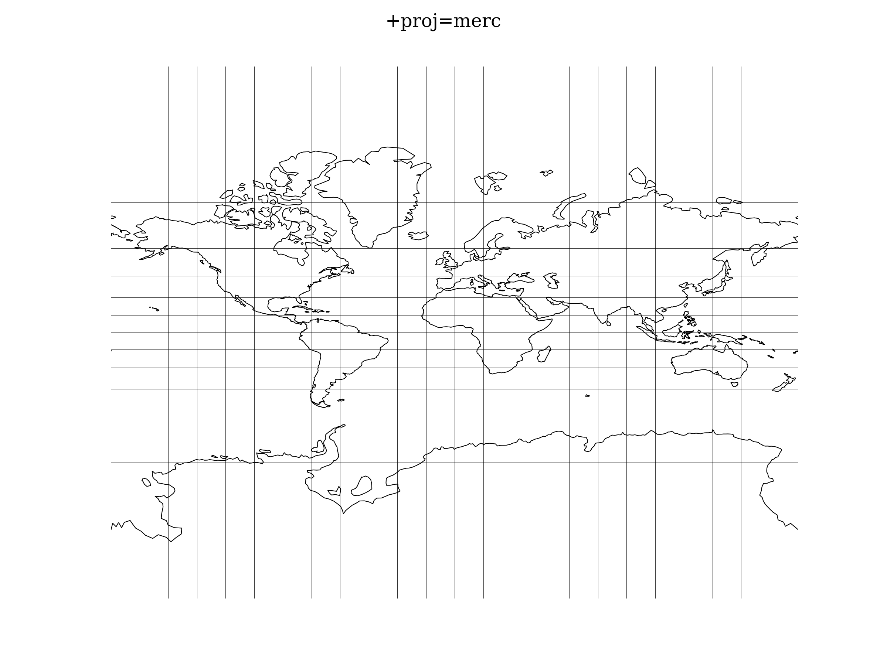

.. _merc:

********************************************************************************
Mercator
********************************************************************************

Scaling may be specified by either the latitude of true scale (:math:`\phi_{ts}`) or setting :math:`k_0` with :math:`+k=` or :math:`+k_0=`.

The spherical form :

.. math::

   x = k_0 \lambda

.. math::

   y = k_0 * \ln( \tan(\pi/4 + \phi/2))

.. math::

   k_0 = \cos(\phi_{ts})

The spherical form's reverse operation :

.. math::

   \lambda = x/k_0

.. math::

   \phi = \pi/2 - 2 \arctan(e^{-y/k_0})

.. math::

   k_0 = \cos(\phi_{ts})

The elliptical form :

.. math::

   x = k_0 \lambda

.. math::

   y = k_0 \ln(t(\phi))

.. math::

   k_0 = m(\phi_{ts})

The elliptical form's reverse operation :

.. math::

  \lambda = x / k_0

.. math::

  \phi = t^{-1} (e^{-y/k_0})

where :math:`t()` is the isometric latitude kernel function :

.. math::

   t = \tan(\pi/4 + \phi/2) ( \frac{1 - e \sin \phi}{1 + e \sin \phi})^{e/2}

and the inverse of isometric latitude need to be iteratively solve for \phi_+ until a sufficiently small difference between evaluations occurs :

.. math::

   \phi_+ = \pi/2 - 2 \arctan(t(\frac{1 - e \sin \phi}{1+e \sin \phi})^{e/2})

.. math::

   t = e^{-\tau}

with an initial value of :

.. math::

   \phi = \pi / 2 - 2 \arctan(t)

and :math:`m(\phi)` is the parallel radius at latitude :math:`\phi` :

.. math::

   m = N \cos \phi = \frac{a cos \phi}{\sqrt{1-e^2\sin^2 \phi}}

where N is the radius of curvature of the ellipse perpendicular to the plane of the meridian. A unit major axis(a) is used.
