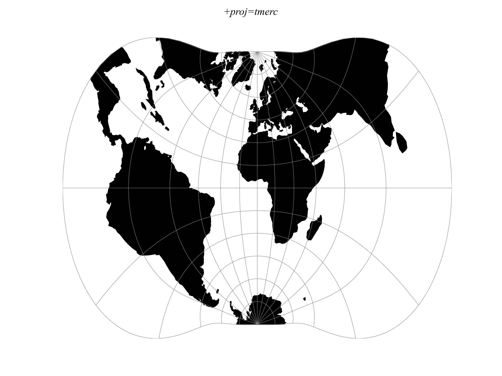

.. _tmerc:

********************************************************************************
Transverse Mercator (Gauss-Kruger)
********************************************************************************

The transverse Mercator projection in its various forms is the most widely used projected coordinate system for world topographical and offshore mapping.

+---------------------+--------------------------------------------------------------------------------+
| **Classification**  | Transverse and oblique cylindrical                                             |
+---------------------+--------------------------------------------------------------------------------+
| **Available forms** | Forward and inverse, Spherical and Elliptical                                  |
+---------------------+--------------------------------------------------------------------------------+
| **Defined area**    | Global, but reasonably accurate only within 15 degrees of the central meridian |
+---------------------+--------------------------------------------------------------------------------+
| **Implemented by**  | Gerald I. Evenden                                                              |
+---------------------+--------------------------------------------------------------------------------+
| **Options**                                                                                          |
+---------------------+--------------------------------------------------------------------------------+
| `+lat_0`            | Latitude of origin (Default to 0)                                              |
+---------------------+--------------------------------------------------------------------------------+
| `+k0`               | Scale factor at natural origin (Default to 1)                                  |
+---------------------+--------------------------------------------------------------------------------+

Usage
#####

Prior to the development of the Universal Transverse Mercator coordinate system, several European nations demonstrated the utility of grid-based conformal maps by mapping their territory during the interwar period. Calculating the distance between two points on these maps could be performed more easily in the field (using the Pythagorean theorem) than was possible using the trigonometric formulas required under the graticule-based system of latitude and longitude. In the post-war years, these concepts were extended into the Universal Transverse Mercator/Universal Polar Stereographic (UTM/UPS) coordinate system, which is a global (or universal) system of grid-based maps.

The following table gives special cases of the Transverse Mercator projection.

+-------------------------------------+-----------------------------------------------------+--------------------------------+------------------------------------------+--------------+
| Projection Name                     | Areas                                               | Central meridian               | Zone width                               | Scale Factor |
+-------------------------------------+-----------------------------------------------------+--------------------------------+------------------------------------------+--------------+
| Transverse Mercator                 | World wide                                          | Various                        | less than 6°                             | Various      |
+-------------------------------------+-----------------------------------------------------+--------------------------------+------------------------------------------+--------------+
| Transverse Mercator south oriented  | Southern Africa                                     | 2° intervals E of 11°E         | 2°                                       | 1.000        |
+-------------------------------------+-----------------------------------------------------+--------------------------------+------------------------------------------+--------------+
| UTM North hemisphere                | World wide equator to 84°N                          | 6° intervals E & W of 3° E & W | Always 6°                                | 0.9996       |
+-------------------------------------+-----------------------------------------------------+--------------------------------+------------------------------------------+--------------+
| UTM South hemisphere                | World wide north of 80°S to equator                 | 6° intervals E & W of 3° E & W | Always 6°                                | 0.9996       |
+-------------------------------------+-----------------------------------------------------+--------------------------------+------------------------------------------+--------------+
| Gauss-Kruger                        | Former USSR, Yugoslavia, Germany, S. America, China | Various, according to area     | Usually less than 6°, often less than 4° | 1.0000       |
+-------------------------------------+-----------------------------------------------------+--------------------------------+------------------------------------------+--------------+
| Gauss Boaga                         | Italy                                               | Various, according to area     | 6°                                       | 0.9996       |
+-------------------------------------+-----------------------------------------------------+--------------------------------+------------------------------------------+--------------+

Example using Gauss-Kruger on Germany area (aka EPSG:31467) ::

    $ echo 9 51 | proj +proj=tmerc +lat_0=0 +lon_0=9 +k=1 +x_0=3500000 +y_0=0 +ellps=bessel +datum=potsdam +units=m +no_defs
    3500000.00	5651505.56

Example using Gauss Boaga on Italy area (EPSG:3004) ::

    $ echo 15 42 | proj +proj=tmerc +lat_0=0 +lon_0=15 +k=0.9996 +x_0=2520000 +y_0=0 +ellps=intl +units=m +no_defs
    2520000.00	4649858.60 

Mathematical definition
#######################

The formulas describing the Transverse Mercator are all taken from proj4 sources.

:math:`\phi_0` is the latitude of origin that match the center of the map. It can be set with ``+lat_0``.

:math:`k_0` is the scale factor at the natural origin (on the central meridian). It can be set with ``+k_0``.

Spherical form
**************

Forward projection
==================

.. math::

   B = \cos \phi \sin \lambda

.. math::

   x = \frac{k_0}{2} \ln(\frac{1+B}{1-B})

.. math::

   y = k_0 ( \arctan(\frac{\tan(\phi)}{\cos \lambda}) - \phi_0)

Inverse projection
==================

.. math::

  D = \frac{y}{k_0} + \phi_0

.. math::

  \phi = \arcsin(\frac{\sin D}{\cosh x'})

.. math::

  \lambda = \arctan(\frac{\sinh x'}{\cos D})

.. math::

  x' = \frac{x}{k_0}

Further reading
###############

#. `Wikipedia <https://en.wikipedia.org/wiki/Universal_Transverse_Mercator_coordinate_system>`_
#. `EPSG, POSC literature pertaining to Coordinate Conversions and Transformations including Formulas  <http://www.ihsenergy.com/epsg/guid7.pdf>`_
