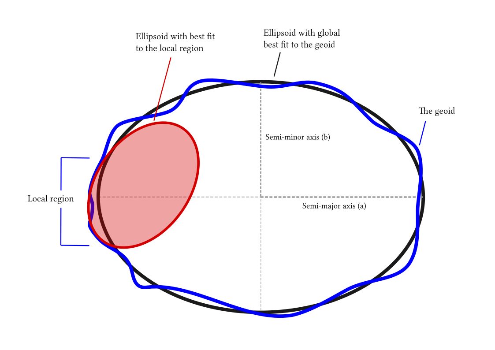

.. _ellipsoids:

================================================================================
Ellipsoids
================================================================================
An ellipsoid is a mathematically defined surface which approximates the *geoid*:
the surface of the Earth's gravity field, which is approximately the same as
mean sea level.

   Global and local fitting of the ellipsoid

A complete ellipsoid definition comprises a size (primary) and a shape (secondary)
parameter.

Ellipsoid size parameters
+++++++++++++++++++++++++++++++++++++++++++++++++++++++++++++++++++++++++++++++
.. _ellipsoid_size_parameters:

.. option:: +R=<value>

Radius of the sphere

.. option:: +a=<value>

Semi-major axis of the ellipsoid

Ellipsoid shape parameters
+++++++++++++++++++++++++++++++++++++++++++++++++++++++++++++++++++++++++++++++
.. _ellipsoid_shape_parameters:

.. option:: +rf=<value>

Reverse flattening of the ellipsoid

.. option:: +f=<value>

Flattening of the ellipsoid

.. option:: +es=<value>

Eccentricity squared

.. option:: +e=<value>

Eccentricity

.. option:: +b=<value>

Semi-minor axis

The ellipsoid definition may be augmented with a spherification flag, turning
the ellipsoid into a sphere with features defined by the ellipsoid.

Ellipsoid spherification parameters
+++++++++++++++++++++++++++++++++++++++++++++++++++++++++++++++++++++++++++++++
.. _ellipsoid_spherification_parameters:

.. option:: +R_A=<value>

A sphere with the same surface area and volume as the ellipsoid

.. option:: +R_a=<value>

A sphere with R = (a + b)/2   (arithmetic mean)

.. option:: +R_g=<value>

A sphere with R = sqrt(a*b)   (geometric mean)

.. option:: +R_h=<value>

A sphere with R = 2*a*b/(a+b) (harmonic mean)

.. option:: +R_lat_a=<phi>

A sphere with R being the arithmetic mean of the corresponding ellipsoid at
latitude phi.

.. option:: +R_lat_g=<phi>

A sphere with R being the geometric mean of the corresponding ellipsoid at
latitude phi.

If :option:`+R` is given as size parameter, any shape and spherification
parameters given are ignored.

Local ellipsoid examples
+++++++++++++++++++++++++++++++++++++++++++++++++++++++++++++++++++++++++++++++
.. _ellipsoid_local_examples:

The ``ellps=xxx`` parameter provides both size and shape for a number of
built-in ellipsoid definitions.

    ============   =================================    ============================
    ellps          Parameters                           Datum name
    ============   =================================    ============================
    GRS80          a=6378137.0      rf=298.257222101    GRS 1980(IUGG, 1980)
    airy           a=6377563.396    b=6356256.910       Airy 1830
    bessel         a=6377397.155    rf=299.1528128      Bessel 1841
    clrk66         a=6378206.4      b=6356583.8         Clarke 1866
    intl           a=6378388.0      rf=297.             International 1909 (Hayford)
    WGS60          a=6378165.0      rf=298.3            WGS 60
    WGS66          a=6378145.0      rf=298.25           WGS 66
    WGS72          a=6378135.0      rf=298.26           WGS 72
    WGS84          a=6378137.0      rf=298.257223563    WGS 84
    sphere         a=6370997.0      b=6370997.0         Normal Sphere (r=6370997)
    ============   =================================    ============================

If size and shape are given as ``ellps=xxx``, later shape and size parameters
are are taken into account as modifiers for the built-in ellipsoid definition.

While this may seem strange, it is in accordance with historical PROJ
behavior. It can e.g. be used to define coordinates on the ellipsoid
scaled to unit semimajor axis by specifying ``+ellps=xxx +a=1``

Transformation examples
+++++++++++++++++++++++++++++++++++++++++++++++++++++++++++++++++++++++++++++++
.. _ellipsoid_transformation_examples:

Spherical earth with radius 7000km:

::

    proj=laton R=7000000

Using the GRS80 ellipsoid:

::

    proj=laton ellps=GRS80

Expressing ellipsoid by semi-major axis and reverse flattening (1/f):

::

    proj=laton a=6378137.0 rf=298.25

Spherical earth based on volume of ellipsoid

::

    proj=laton a=6378137.0 rf=298.25 +R_V

