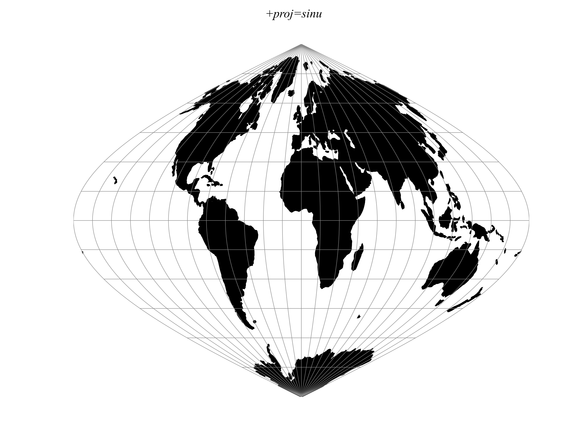

.. _sinu:

********************************************************************************
Sinusoidal (Sanson-Flamsteed)
********************************************************************************

MacBryde and Thomas developed generalized formulas for sever of the
pseudocylindricals with sinusoidal meridians:

.. math::

    x = C\lambda(m+cos\theta) / ( m + 1)

.. math::
    y = C\theta

.. math::

    C = \sqrt { (m + 1 ) / n }

