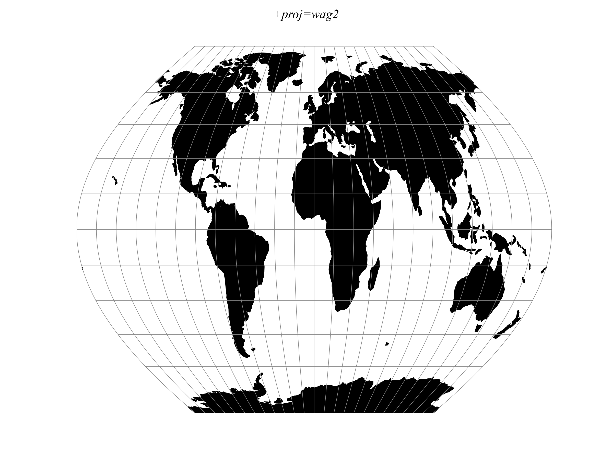

.. _wag2:

********************************************************************************
Wagner II
********************************************************************************

.. math::

    x &= 0.92483 \lambda \cos \theta

    y &= 1.38725\theta

    \sin \theta &= 0.88022 \sin(0.8855\phi)
