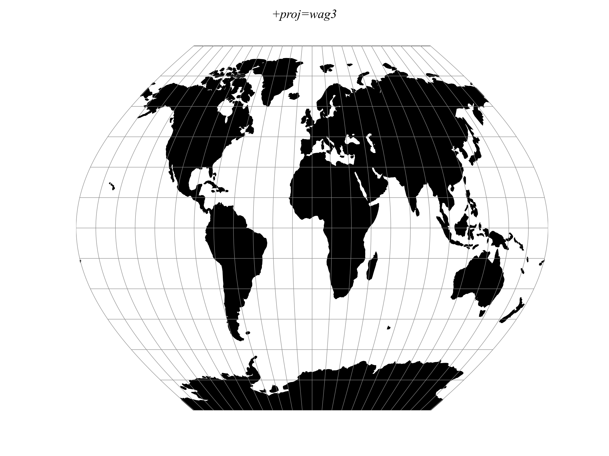

.. _wag3:

********************************************************************************
Wagner III
********************************************************************************

.. math::

    x &= [\cos\phi_{ts} / \cos ( 2\phi_{ts} / 3)] \lambda \cos (2\phi /3)

    y = \phi
